```{ojs}
//| echo: false
now = new Date
```

## תזכורת לשיעור הקודם

-   למדנו איך לבצע מניפולציות מרחביות

## בשיעור היום

-   נבין מהו צירוף וכיצד מבצעים אותו

-   נלמד על מקורות מידע גאוגרפיים בישראל ובעולם

## על צירוף טבלאי - השלמה

בשיעור הקודם למדנו כיצד מבצעים צירוף מרחבי בין שתי שכבות.\
עם זאת, חלק מהיחסים לא הוגדרו כמו שצריך. לכן כעת נעמיק בנושא זה

## צירוף טבלאי - יחסים {.smaller}

צירופים טבלאיים מתייחסים לאופן שבו טבלאות נתונים משויכות זו לזו בבסיסי נתונים או במסגרת ניתוח נתונים:

1.  אחד לאחד (1:1): לכל שורה בטבלה הראשונה יש שורה אחת מתאימה בטבלה השנייה ולהפך. דוגמה: טבלת משתמשים וטבלת פרופילים, כאשר לכל משתמש יש פרופיל יחיד.

2.  אחד לרבים (1:N): לכל שורה בטבלה הראשונה יכולות להיות מספר שורות מתאימות בטבלה השנייה, אך לכל שורה בטבלה השנייה יש שורה אחת מתאימה בטבלה הראשונה. דוגמה: טבלת משתמשים וטבלת הזמנות, כאשר משתמש אחד יכול לבצע מספר הזמנות.

------------------------------------------------------------------------

3.  רבים לרבים (M:N): לכל שורה בטבלה הראשונה יכולות להיות מספר התאמות בטבלה השנייה ולהפך. קשר כזה מתבצע בדרך כלל דרך טבלת קשרים (junction table). דוגמה: טבלת סטודנטים וטבלת קורסים, כאשר סטודנט יכול להירשם למספר קורסים וכל קורס כולל מספר סטודנטים.

השימוש בכל סוג קשר תלוי במבנה הנתונים ובקשרים הלוגיים בין הישויות המיוצגות בטבלאות.

## **אחד לאחד (1:1)** {.smaller style="font-size: 0.6em;"}

### טבלת משתמשים:

| UserID | Name  |
|--------|-------|
| 1      | Alice |
| 2      | Bob   |

### טבלת פרופילים:

| ProfileID | UserID | Email            |
|-----------|--------|------------------|
| 1         | 1      | alice\@email.com |
| 2         | 2      | bob\@email.com   |

------------------------------------------------------------------------

### טבלה מקושרת (Join):

| UserID | Name  | ProfileID | Email            |
|--------|-------|-----------|------------------|
| 1      | Alice | 1         | alice\@email.com |
| 2      | Bob   | 2         | bob\@email.com   |

------------------------------------------------------------------------

## **אחד לרבים (1:N)** {.smaller style="font-size: 0.6em;"}

### טבלת משתמשים:

| UserID | Name  |
|--------|-------|
| 1      | Alice |
| 2      | Bob   |

### טבלת הזמנות:

| OrderID | UserID | OrderDate  |
|---------|--------|------------|
| 101     | 1      | 2025-01-01 |
| 102     | 1      | 2025-01-05 |
| 103     | 2      | 2025-01-03 |

------------------------------------------------------------------------

### טבלה מקושרת (Join):

| UserID | Name  | OrderID | OrderDate  |
|--------|-------|---------|------------|
| 1      | Alice | 101     | 2025-01-01 |
| 1      | Alice | 102     | 2025-01-05 |
| 2      | Bob   | 103     | 2025-01-03 |

------------------------------------------------------------------------

## **רבים לרבים (M:N)** {.smaller style="font-size: 0.6em;"}

### טבלת סטודנטים:

| StudentID | Name  |
|-----------|-------|
| 1         | Alice |
| 2         | Bob   |

### טבלת קורסים:

| CourseID | CourseName       |
|----------|------------------|
| 101      | Mathematics      |
| 102      | Computer Science |

------------------------------------------------------------------------

### טבלת קשרים (רישום לקורסים):

| StudentID | CourseID |
|-----------|----------|
| 1         | 101      |
| 1         | 102      |
| 2         | 101      |

------------------------------------------------------------------------

### טבלה מקושרת (Join):

| StudentID | Name  | CourseID | CourseName       |
|-----------|-------|----------|------------------|
| 1         | Alice | 101      | Mathematics      |
| 1         | Alice | 102      | Computer Science |
| 2         | Bob   | 101      | Mathematics      |

------------------------------------------------------------------------

## כיצד נבצע צירוף טבלאי באמצעות התוכנה?

קיימות מספר דרכים לביצוע צירוף:

1.  בהגדרות השכבה
2.  באמצעות אלגוריתמים של כלי העיבוד

## צירוף בהגדרות השכבה

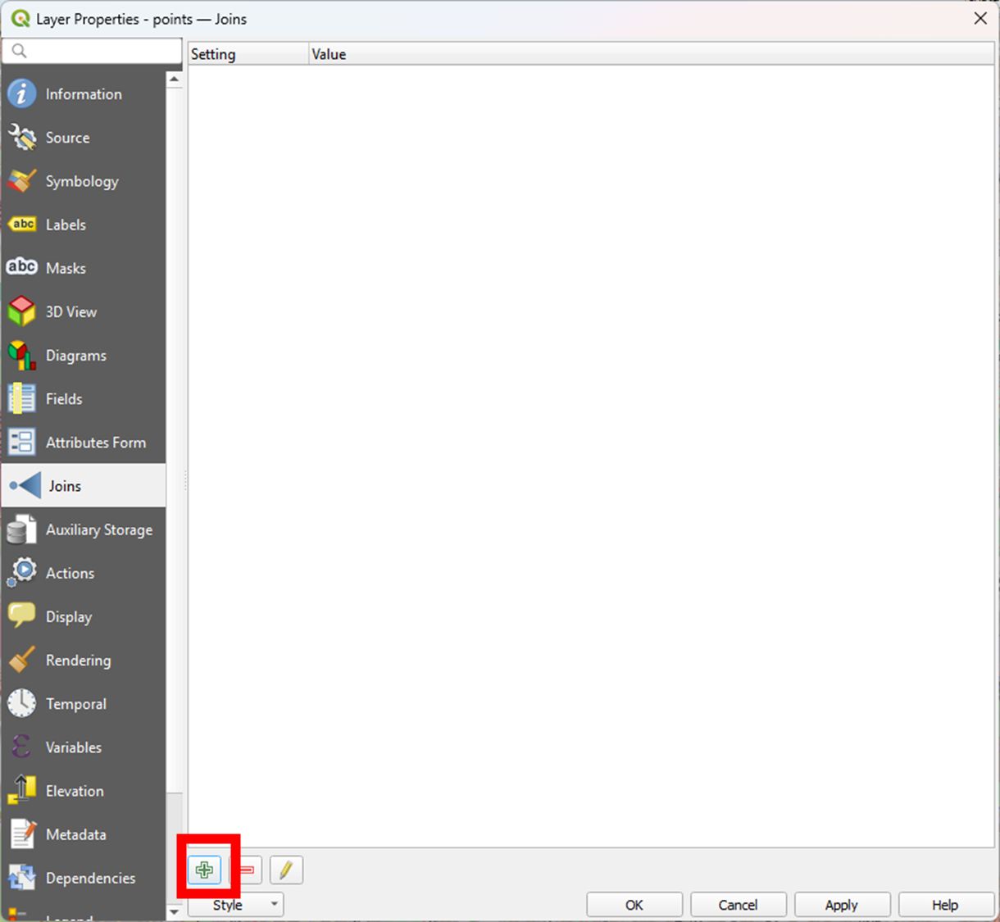{width="501"}

הוספת צירוף

------------------------------------------------------------------------

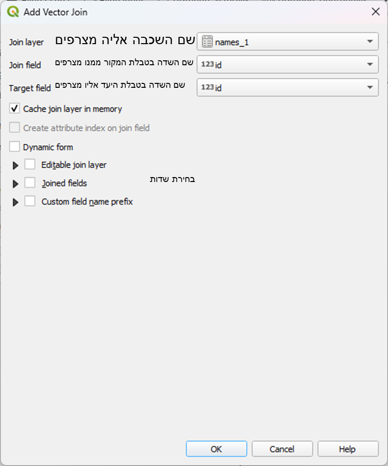

## תוצאה

לפני

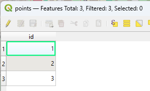

אחרי

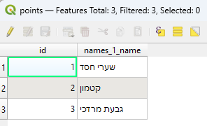

## אפשרויות נוספות

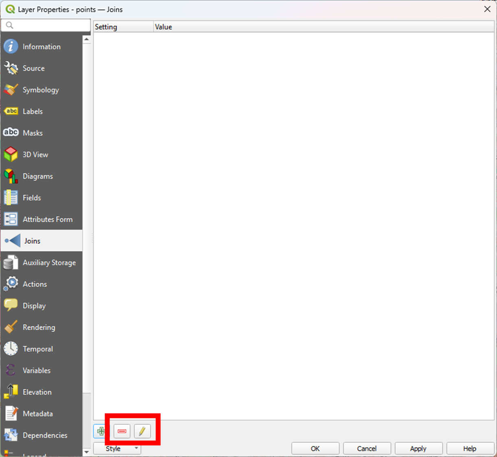{width="610"}

מחיקת צירוף\
עריכת צירוף

## מגבלות

מאפשר אך ורק צירוף של אחד לאחד

מאפשר צירוף רק לפי שדה אחד ולא יותר

## צירוף באמצעות אלגוריתמים

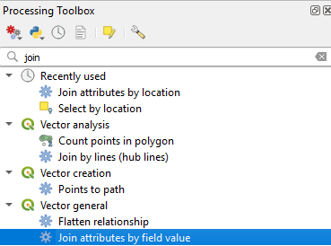

------------------------------------------------------------------------

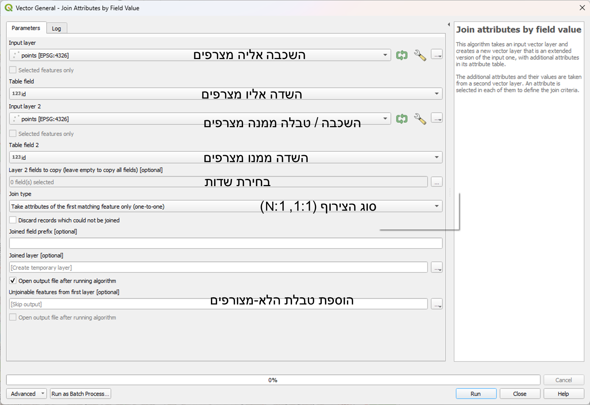

## צירוף מרחבי - יותר מורכב משחשבנו

בשיעור הקודם למדנו על צירוף מרחבי "פשוט".

קיימים עוד סוגים רבים של צירוף מרחבי:

לפי מרחק

צירוף ויזואלי בין שתי שכבות

רבים לרבים (למעשה הצלבה)

## תזכורת - צירוף מרחבי פשוט

ניתן להצמיד ישויות לפי היחס המרחבי ביניהן. היינו להגיד - עבור נקודות המצטלבות עם הפוליגו1ן, עם איזה פוליגון הן מצולבות

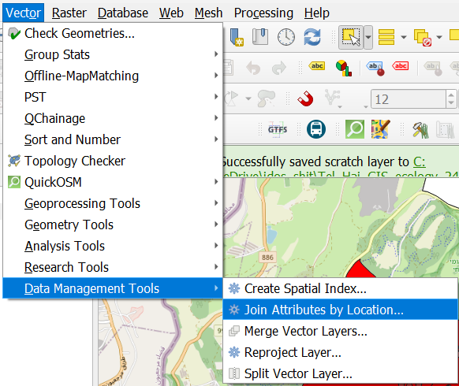

------------------------------------------------------------------------

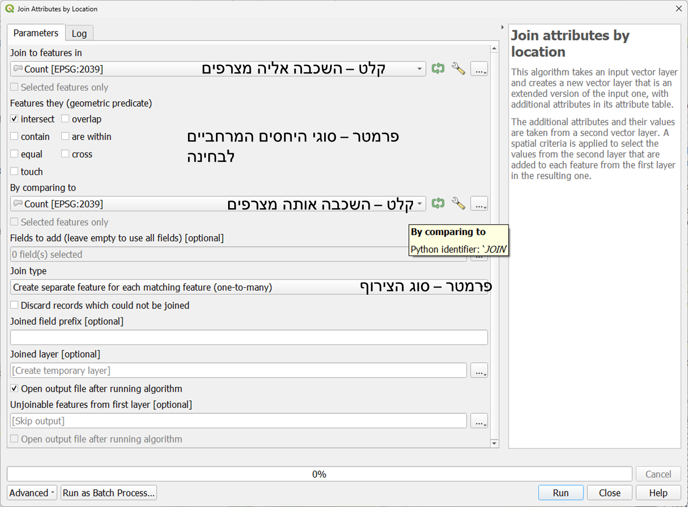

## צירוף לפי מרחק

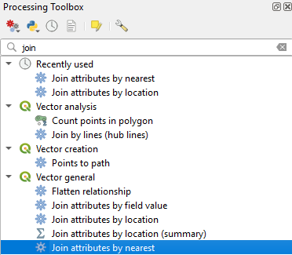

## צירוף ויזואלי בין שתי שכבות

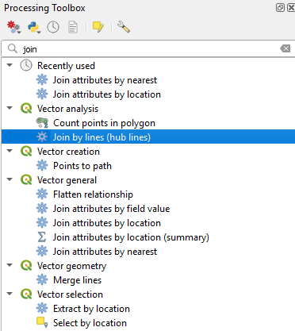

## הצלבה - צירוף רבים לרבים

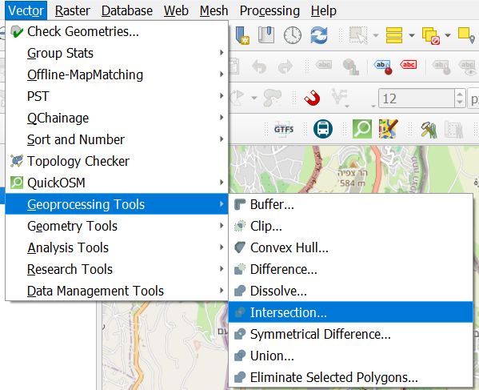

------------------------------------------------------------------------


## מקורות מידע

בשביל לעבוד עם ממ"ג אין סיבה לייצר לבד את הנתונים.

יש נתונים רבים הזמינים ברשת עבור כל מי שצריך.

שימוש בנתונים ממקורות אחידים מסייע בהשגת אמת אחת עבור ארגונים ובמיוחד בעבודה בין ארגונית.

## צפייני GIS עירוניים/ארגוניים

אתרים ארגוניים מכילים בחלק גדול מאוד מהמקרים צפייני gis במידע הארגוני המונגש ככזה.

לא כל הארגונים מנגישים את המידע.

לא כל הארגונים מאפשרים את הורדת המידע.

לא כל הארגונים מאפשרים גישה ישירה למידע.

אבל יש כאלה שכן מאפשרים גישה כזו.

------------------------------------------------------------------------

במקרים רבים עיריות מנגישות את המידע דרך service גאוגרפי, לרוב של esri

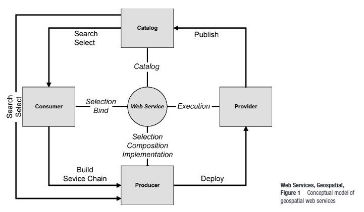

## מערכות ארגוניות

## טעינת שכבות מתוך סרויס

נקבל כתובת של סרויס (כרגע לא נלמד כיצד להשיג אותה בכוחות עצמנו. לפרטים נוספים [כאן](https://idshklein.github.io/amav_qgis/lesson_5/qgis5.html#(4)))

למשל, שכבות עיריית ירושלים:

<https://gisviewer.jerusalem.muni.il/arcgis/rest/services/>

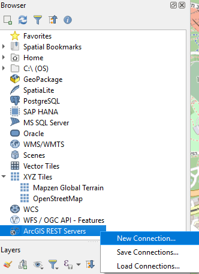

------------------------------------------------------------------------

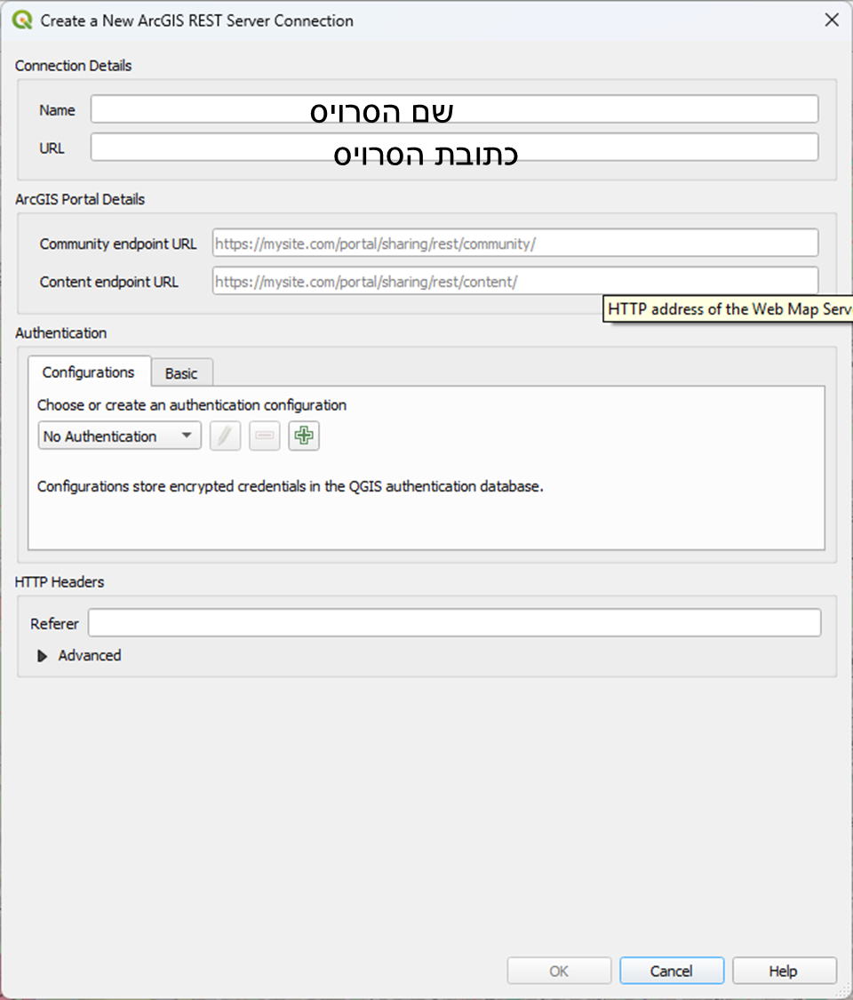{width="753"}

------------------------------------------------------------------------

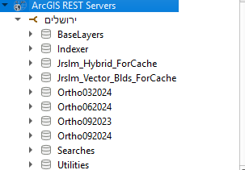

## openstreetmap

ה"ויקיפדיה" של המפות. המידע שם נתרם על ידי המשתמשים עצמם + ארגונים ששחררו את המידע.

המידע הינו חופשי לשימוש הכלל.

מבנה הנתונים שונה ממבנה ממ"גי טבלאי המוכר לנו, עם זאת לא נעמיק בו.

כבר דיברנו עליו במהלך הקורס מספר פעמים. ניתן להוריד מידע באמצעות התוכנה ישירות ממנו באמצעות תוסף quickosm. לא נרחיב בנושא כאן אלא רק בהדגמה בשיעור.

## דאטה גוב

אתר ישראלי המכיל הרבה מאוד נתונים, בין היתר נתונים מרחביים.

מתעדכן תדיר.

הדגמה של מספר הורדות מהאתר.

## תרגיל 8

1.  הורידו את קובץ התרגיל

2.  עשו חיץ של 100 מטרים על שכבת building (זכרו להמיר קודם את השכבה לרשת ישראל)

3.  בצעו הצלבה אל מול שכבת stops על מנת להבין אלו תחנות שייכות לאיזה מבנה.

4.  שמרו את שכבת הפלט בתוך הgpkg והגישו.

5.  למתקדמים - השתמשו בכלי **Join by lines (hub lines) על מנת לסרטט קווים בין המבנה לבין התחנות שנמצאות ב100 המטרים ממנו**