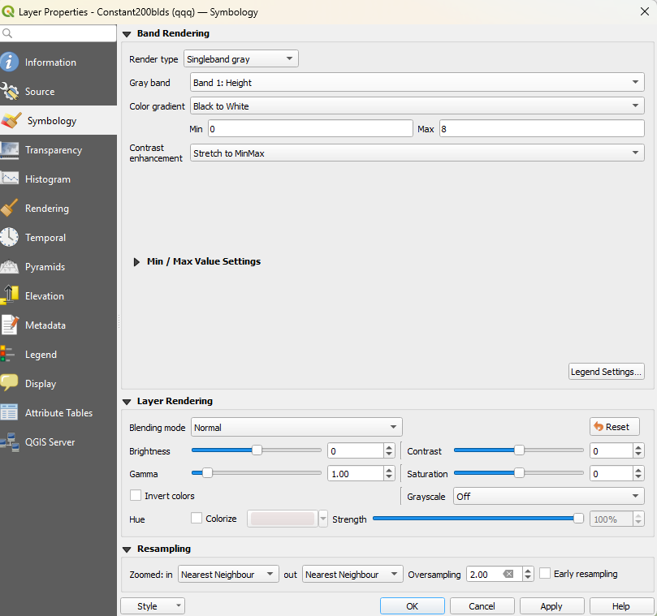

```{ojs}
//| echo: false
now = new Date
```

## תזכורת לשיעור הקודם

-   השלמנו את נושא הצירופים (טבלאיים ומרחביים)
-   הכרנו מקורות מידע גאוגרפיים (DataGov, OSM, ArcGIS Services)
-   סיימנו רשמית את המעבר על עולם הוקטור (נקודות, קווים ופוליגונים)

## בשיעור היום

-   נכיר את עולם הרסטרים

-   נלמד כיצד בנויים רסטרים שונים

-   נלמד כיצד לייצג רסטרים שונים

## מהו רסטר?

רסטר הוא סוג אחר של ייצוג נתונים.

עד כה, הסתכלנו על טבלאות, כאשר כל שורה בטבלה מייצגת ישות אחרת.

ברסטר, הישויות מיוצגות על ידי תאי הטבלה, כאשר העמודה והשורה מייצגות את המיקום

## רגע, מה?

| מזהה ישות | עמודה עם פרט מידע 1 | עמודה עם פרט מידע 2 | עמודה מרחבית    |
|-----------|---------------------|---------------------|-----------------|
| 1         | שלמה                | 51                  | LINESTRING(...) |
| 2         | חיים                | 49                  | LINESTRING(...) |
| 3         | מאיר                | 35                  | LINESTRING(...) |
| 4         | אברהם               | 97                  | LINESTRING(...) |
| 5         | יצחק                | 46                  | LINESTRING(...) |

: דוגמא לשכבה וקטורית קווית

------------------------------------------------------------------------

|       | 1   | 2   | 3   | 4   | 5   |
|-------|-----|-----|-----|-----|-----|
| **1** | 4   | 8   | 4   | 9   | 1   |
| **2** | 0   | 10  | 1   | 6   | 6   |
| **3** | 1   | 6   | 2   | 3   | 5   |
| **4** | 2   | 3   | 1   | 2   | 2   |
| **5** | 6   | 54  | 3   | 1   | 3   |

: דוגמא לשכבה רסטרית

## מה בעצם קרה פה? {.smaller}

הגדרנו שורה מסוימת בתור טווח מסוים עבור קואורדינטות הרוחב, ואת הסמוכים לה לרציפים אליה:

1:100000-150000,2:150000-200000, וכן הלאה

הגדרנו עמודה מסוימת בתור טווח מסוים עבור קואורדינטות האורך, בדיוק כמו שעשינו לרוחב

כל תא מוגדר באותו אורך, ובאותו רוחב. האורך והרוחב ברוב המוחלט של המקרים יהיו שווים אחד לשני, ולכן התאים יהיו ריבועיים, אבל זה לא מחויב.

ה"ישות" המרחבית נמצאת בתא, וניתן לצרף אליה בעצם רק ערך אחד. (אך כמו שנראה, אפשר גם יותר)

## למה בכלל משתמשים ברסטר?

כי לפעמים מידע וקטורי לא מתאים לשמירה או עיבוד זריז של נתונים.

## הבדלים מהותיים בין רסטר ווקטור

רסטר - שמירת הנתונים בצורה של טבלה עם ערך אחד, בניגוד לקובץ וקטורים המכיל ישויות גאוגרפיות שונות באמצעות מערך נקודות, שיכול לקבל ערכים רבים.

ברסטר - כל ריבוע הוא ישות, למעשה, אבל כל ישות זהה לחברותיה מבחינת מימדים.

## צורות שונות להסתכל על רסטר

לפי סוג המידע - רציף, קטגוריאלי

לפי כמות הערוצים - אחד? שניים? שלושה? יותר?

לפי מטרת הרסטר - תמונה/תצלום? ייצוג גבהים? ייצוג תופעה מרחבית אחרת?

## טעינת שכבות רסטריות

שכבות רסטריות יגיעו בקבצים בסיומות שונות. tif היא סיומת יחסית רגילה עבור קבצים רסטרים. עם זאת - ניתן לשמור רסטר בתוך GPKG, ועל כך בהמשך.

שכבות רסטריות לדוגמא קיימות בgpkg המצורף לשיעור זה.

## חקירת השכבות

שימוש בidentify

## ייצוג השכבות

התנסות בשליטה על סימבולוגיה של השכבה הרסטרית


## רסטר מרובה ערוצים

למעשה - כל תמונה שאתם מסתכלים עליה בנייד

## איך זה עובד?

עורמים 3 רסטרים אחד על גבי השני

אחד מייצג את הצבע האדום (R)

אחד מייצג את הצבע הירוק (G)

אחד מייצג את הצבע הכחול (B)

כל אחד מהערוצים מקבל ערך מ0 עד 255. הצבע המתקבל הוא המזיגה של הצבעים ביחד, כמו בגן או בטיקטוק.

[לינק לסרטון הדגמה](https://www.facebook.com/reel/9432059606858436)

## ייצוא הרסטר

שמירה כtiff


## תרגיל 9 {.smaller}

1.  הורידו את קובץ התרגיל
2.  צרו תמה בה תחנות האוטובוס מופיעות מעל נקודות החום של תחנות האוטובוס, כאשר שכבת החום מיוצגת בתור סקאלה של צבעים מקר לחם
3.  צרו תמה בה שכבת המבנים מופיעה מעל שכבת ספירת המבנים ל200 מטרים, כאשר שכבת ספירת המבנים ל200 מטרים מופיע בסקאלה דיסקרטית
4.  צרו תמה בה שכבת המפה מgovmap לא מתחשבת באחד הערוצים שלה
5.  עבור כל התמות - השאירו את מפת הרקע של osm למטה
6.  הגישו חזרה את הקובץ עם כלל התמות