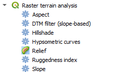
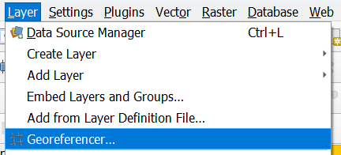
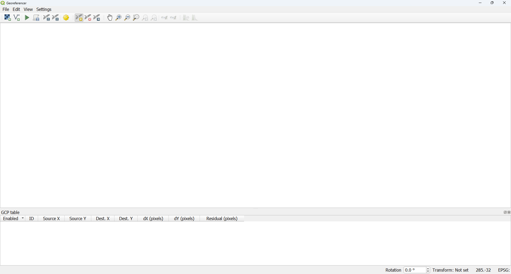
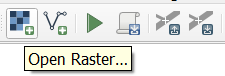
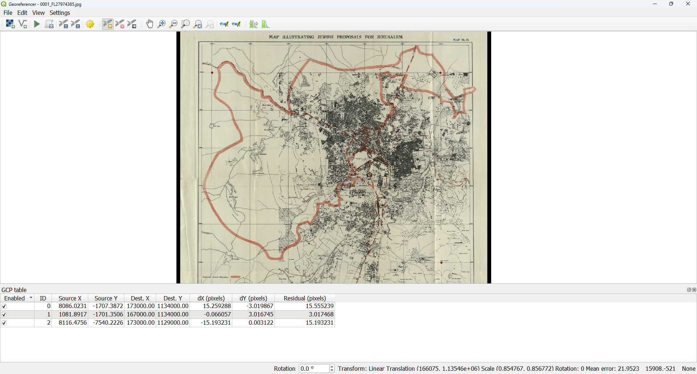
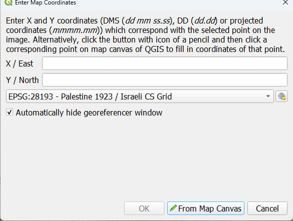
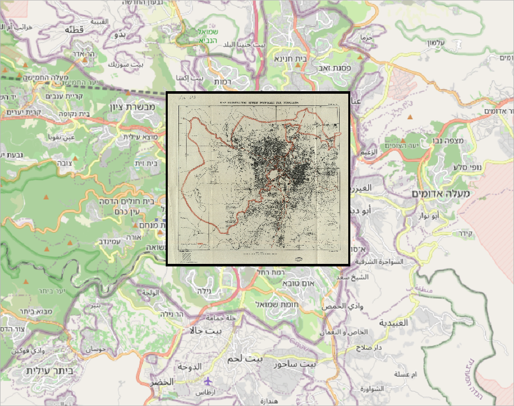
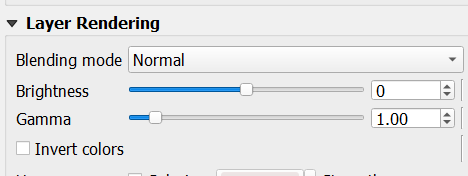
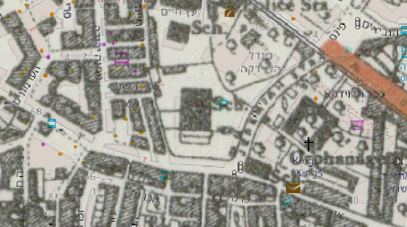
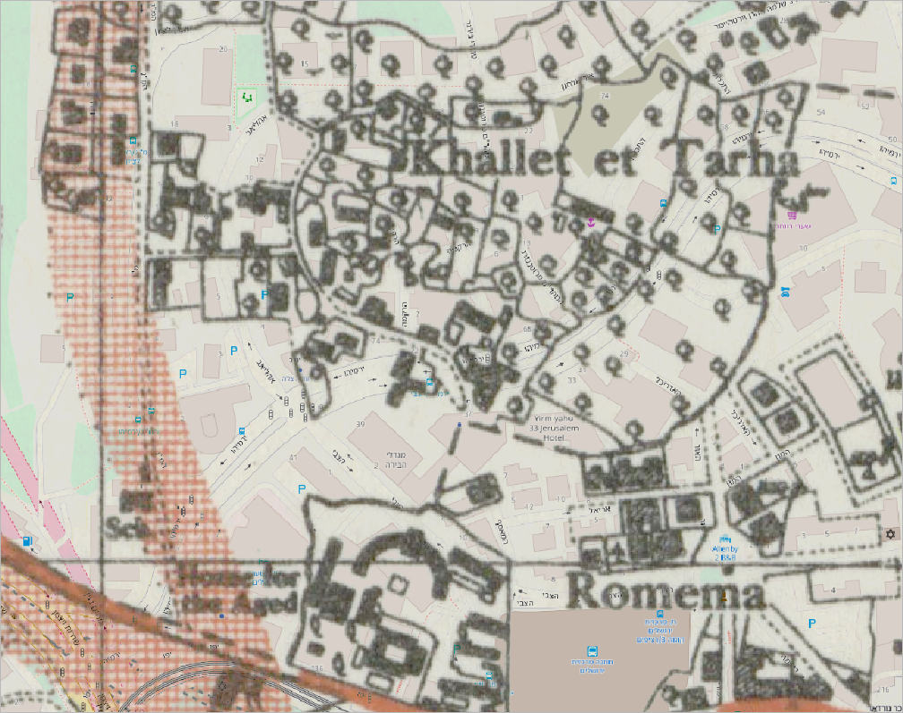

```{ojs}
//| echo: false
now = new Date
```

## תזכורת לשיעור הקודם

-   למדנו איך רסטר בנוי
-   למדנו לטעון רסטר
-   למדנו לסגנן רסטר
-   למדנו לקרוא את הנתונים ברסטר

## בשיעור היום

-   נלמד על dem

-   נלמד כיצד לבצע פעולות על dem

-   נלמד על עיגון רסטר

-   נלמד על מקורות למפות עתיקות

-   נלמד על בלנד מוד

## תזכורת

רסטר הוא מבנה נתונים, הדומה לטבלה, אך בניגוד לשכבה - כאן כל תא מייצג ישות מרחבית, המקבלת ערך אחד בלבד.

## מהו dem? {.smaller}

digital elevation model - מודל רסטרי של גובה השטח מעל גובה פני הים.

כמו ברסטר - הרזולוציה חשובה מאוד.

srtm - Shuttle Radar Topography Mission - מקור נתונים של נאסא עבור חלק גדול מאוד מכדה"א.

רזולוציה - srtm הוא ב30\*30. מדובר ברזולוציה נמוכה יחסית, כיום יש טכנולוגיות המאפשרות dem ברמת 10\*10 ס"מ.

הכל נמצא בתלות באופי השימוש.

## איך מייצרים dem? {.smaller}

בעבר - מדידות גבהים ידניות ואינטרפולציות - מאזנות/תאודוליט

(ברמוטר אינו מדויק דיו)

בשלבים יותר מאוחרים - לווינים ופוטוגרמטריה.

כיום - ליידר

אפשרי גם עם סונאר, אבל בעיקר בתווך התת קרקעי

## איך נראה dem?

הדגמה, כולל הורדה של הdem

## איך נייצג בתוכנה dem?

גובה

הצללה

קונטורים



## שיפוע - slope {.smaller}

מאפשר לחשב את השיפוע בין שני תאים.

לוקח בחשבון את סביבת התא, ומחשב את השיפוע באורך וברוחב וממשקל את הגרדיאנט המשותף.

## מפנה - aspect

מחשב לאיזה כיוון השיפוע של התא פונה, על פי סביבת התא.

## הצללה - hillshade

מחשב אילו תאים הוא מוארים ואלו מוצללים בהינתן קרינת אור בזווית מסוימת

## קונטורים - contour

מחשב את קווי הגובה הוקטורים של השכבה - ייצוג שונה של גבהים. מוכר מאוד ממפת סימון שבילים.

## נצפות - viewshed

מאפשר להבין אלו אזורים ניתנים לצפייה מנקודה בגובה מסוים.

## פרופיל גבהים - elevation profile

בהינתן שכבה רסטרית, ניתן לייצר חתך המציג את פרופיל הגובה לאורך קו

## עיגון רסטר בתאוריה {.smaller}

בעיגון רסטר, הכוונה היא לקיחת תמונה/מפה שקיימת בתמונה ולעגן אותה בצורה דיגטלית למרחב, כך שיהיה ניתן לצפות בה יחד עם נתונים וקטוריים באותה התמונה, ולערוך חישובים המפיקים תוצאה מרחבית ברורה.

על מנת לעגן רסטר, יש צורך בבחירה של לפחות 3 נקודות על גבי התמונה

## עיגון רסטר בפועל



הכניסה למעגן הרסטרים (georefrencer) היא דרך תפריט השכבה.

------------------------------------------------------------------------

כך נראה חלון העיגון.



------------------------------------------------------------------------



הכפתור החשוב בהקשר זה - הוספת רסטר

## בחירת נקודות עיגון



------------------------------------------------------------------------

הוספת נקודות עיגון - בין אם על ידי כתיבה ובין אם על ידי בחירה מהמפה.



## שיטות שונות לבחירת נקודות עיגון

1.  על פי הקואורדינטות על גבי המפה
2.  על פי נקודות ציון מובהקות ברות אבחנה

בנוסף - יש לבחור אם להזין ערכים או לדקור נקודה.

הערה לגבי מפות עתיקות שמקודדות ברשת ישראל ישנה - יש להוסיף מיליון לציר הצפון דרום.

## תוצאה זמנית



## שקיפות/בלנד מוד

בשביל לראות מה יש מתחת למפה - צריך או להשקיף את התמונה - properties -\> transparency -\> סליידר עליון.

אפשר גם להשקיף באמצעות בלנד מוד - תפריט הסימבולוגיה - 

------------------------------------------------------------------------

{width="363"}

דברים שמגלים באמצעות מיפוי כזה - רחוב ירמיהו בירושלים היה פעם בכלל במקום אחר.

{width="363"}

## שמירת שכבה רסטרית בgpkg

דומה מאוד לשמירה של שכבה וקטורית:

לחיצה ימנית

export

save as

ובחירה בפורמט של gpkg.

גם שם יש צורך בהגדרת שם השכבה.

## תרגיל 10

1.  הורידו מפה של ירושלים מ[אוסף המפות על שם ערן לאור](https://www.nli.org.il/he/discover/maps/jerusalem)
2.  עגנו אותה באמצעות הגאורפרנסר
3.  התחברו ל[סרויס של עיריית ירושלים](https://gisviewer.jerusalem.muni.il/arcgis/rest/services/)
4.  הוסיפו את שכבת האנדרטאות
5.  שמרו בפרויקט שבתוך gpkg את השכבה של המפה כשכבה רסטרית
6.  שמרו את סדר השכבות בפרויקט, כך ששכבת האנדרטאות נשאבת ישירות מהסרויס