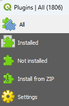
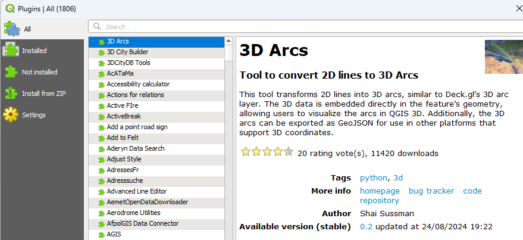
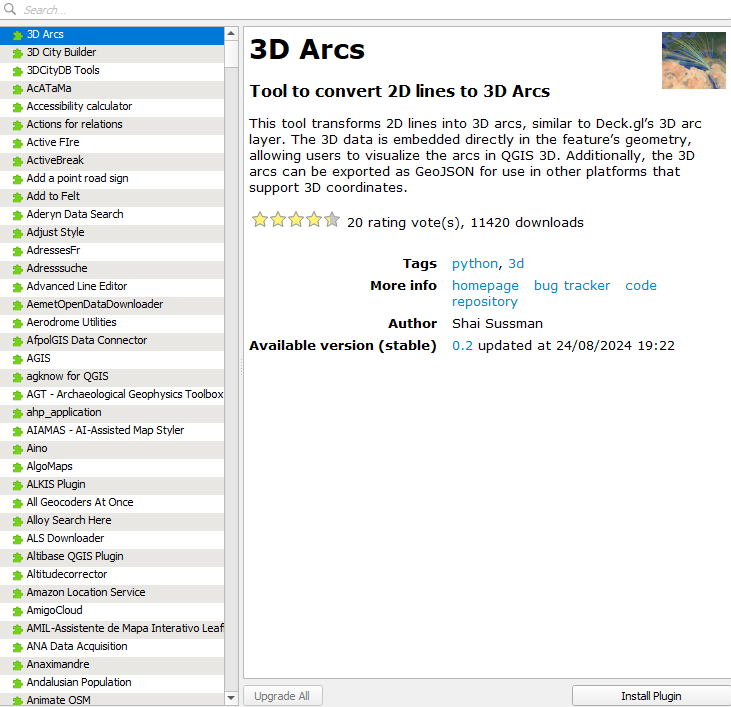

```{ojs}
//| echo: false
now = new Date
```

## תזכורת לשיעור הקודם

-   למדנו איך לעבוד עם dem

-   למדנו לעגן תמונות

## בשיעור היום

-   נלמד על פלאגינים

-   נלמד על QuickMapServices

-   נלמד על quickosm

-   נלמד על רשתות על קצה קצהו של המזלג

-   נסכם את הקורס

-   ניתן את מטלת הסיום של הקורס

## פלאגינים

מה הם?

qgis היא תוכנה בקוד פתוח, מה שאומר שכל אדם שרוצה יכול להתסכל אל תוך "מכסה המנוע" של התוכנה ולבצע שינויים או שדרוגים כרצונו.

על מנת לייצר פלאגין חדש צריך לדעת לתכנת.

אבל בשביל להשתמש - לא צריך לדעת שום דבר חוץ מלהוריד.

## ניהול פלאגינים

תפריט plugins -\> manage and install plugins

נקבל 5 אפשרויות - או כל הפלגינים הקיימים, או אלו המותקנים אצלנו, אלו שאינם מותקנים אצלנו, יכולת להתקין מקובץ זיפ, והגדרות



## איך נדע אם פלאגין הוא טוב? {.smaller}

{width="522"}

יש כמות הורדות, ויש כמות כוכבים שהמשתמשים נתנו, ויש תאריך עדכון אחרון.

(למתקדמים - יש גם להבין מהו בסיס הקוד של הפלאגין ומי המפתח, אבל זה פחות חשוב)

מעל מיליון הורדות - ממש ממש כדאי להוריד

מעל מאה אלף - כנראה פלאגין טוב

תאריך העדכון מלמד אותנו על עדכניות הפיתוח, לפעמים פחות מייצג.

כמות כוכבים רלוונטית בפלאגינים עם מעט הורדות.

## איך נוריד פלאגין?



נלחץ על install plugin. לפעמים יהיו אזהרות בתוכנה. לפעמים רק להתקין זה לא מספיק. אבל בפלאגינים טובים לא אמורה להיות בעיה.

## איך נפעיל פלאגינים?

לרוב זה אמור להיות "ברור", אבל זה לא.

אם זה לא ברור:

שווה ללחוץ על דף הבית או על עזרה, ניתן לראות לרוב מדריכים לשימוש בפלאגין.

## שני פלאגינים שאי אפשר בלעדיהם:

quickmapservices - פלאגין להוספת מפות רקע.

ניתן להוסיף איתו הרבה מאוד מפות רקע. הדגמה בכיתה

<https://nextgis.com/blog/quickmapservices/>

## QuickOSM

מאפשר הורדת מידע בצורה ישירה מosm.

מבנה הנתונים בOSM שונה מאוד ממבנה הנתונים שאנחנו רגילים אליו מוקטור או מרסטר.

הוא מזכיר קצת וקטור אבל יותר מורכב ממנו.

למעשה הכל נמצא בתוך שכבה אחת, אבל - לא לכל ישות יש את כל השדות.

חלק מהישויות "קשורות" אחת לשנייה.

הדגמה עם קובץ xml.

## overpass-api - המנוע של התוסף

התוסף למעשה שולח לשרת של osm שאילתא שכתובה בoverpass api

הדגמה מחוץ לתוכנה - באמצעות overpass turbo

## osminfo - מכפיל כוח

למעשה, מאפשר הורדה ישירה של ישויות

(יש בו באגים. צריך להיזהר)

## רשתות

רשתות הן מבנה נתונים המתייחס לחיבורים בין הקווים בשכבות קוויות.

הן מועילות כי ניתן לבצע עליהם חישובים כאלה ואחרים, בין היתר ניווט או פתרון של מציאת המרחק הקצר ביותר

## אלגוריתם דייקסטרא

אדסחר דייקסטרא היה מדען מחשבים הולנדי, שהמציא אלגוריתם לחישוב המסלול הקצר ביותר על גבי רשת. להלן שתי הדגמות של האלגוריתם:

------------------------------------------------------------------------


------------------------------------------------------------------------


## רשתות - שימוש

הדגמה של הורדת רשת עם quickosm

ניתוח באמצעות qneat3 - יצר לנו גם איזכרון

## הדגמה - הורדת רשת Osm ושימוש בתוסף qneat

הדגמה

## סיכום הקורס - למדנו על:

-   מהו מידע מרחבי

-   מהן מערכות קואורדינטות

-   מהי סימבולוגיה

-   כיצד ממפים

-   כיצד בוחרים מידע בשכבות

-   כיצד עורכים שכבות ומייצרים שכבות חדשות

------------------------------------------------------------------------

-   כיצד מפעילים מניפולציות מרחביות

-   איך מבצעים צירוף מרחבי

-   כיצד שואבים מידע מרחבי

-   מהו רסטר

-   איך עובדים עם dem

-   כיצד מעגנים רסטר

## קהילה {.smaller}

עולם הqgis הינו עולם של קוד פתוח = הקהילה משחקת בו תפקיד מרכזי, במקום חברות.

בישראל יש לנו מספר מוסדות קהילתיים:

[קבוצת פייסבוק](https://www.facebook.com/groups/1843503775922250)

[קבוצת וואטסאפ](https://chat.whatsapp.com/LcMSbVONvAU0sddIpHCPo4)

[ערוץ יוטיוב](https://www.youtube.com/@QGIS-IL) בו משודרים ימים פתוחים

בישראל מספר מפתחי פלאגינים וקהילה הולכת וגוברת של משתמשים ברמות שונות. מוזמנים להצטרף לקהילה בשביל ללמוד וללמד.

## מנהלתי לפני התרגיל המסכם:

בקורס ניתנו 10 תרגילים.

הציונים הם בעובר לא עובר.

יש צורך בהגשת 9 תרגילים בשביל 70% מהציון.
אקבל תרגילים עד מועד ההגשה המסכמת ב5.3.26.


התרגיל המסכם הוא 30% מהציון.

## תרגיל מסכם - עבודת חקר על מידע מרחבי

בחרו נושא למיפוי מרחבי, לדוגמא-

-   בחינה של השוני בין שכונות בחיפה

-   השוואה היסטורית של מבנים בשכונת רחביה בירושלים

או נושא שיאושר על ידי בפגישתנו.


כל אחד יקבע איתי פגישה לאישור הנושא ולבירור נוסף ככל שנצטרך

------------------------------------------------------------------------

יצרו פרויקט בqgis, בתוך קובץ gpkg המכיל את כלל האלמנטים הבאים:

רשימת שכבות וסידורה

לפחות 3 תמות של מפה

לפחות מניפולציה מרחבית אחת או שכבה מקודדת ידנית

לפחות 5 מפות שונות המתארות את התופעה הנחקרת

לפחות 2 סימניות מרחביות

יש להגיש את העבודה המסכמת עד ה5.3.26. 
העבודה תוגש כקובץ gpkg דרך המייל שלי.

