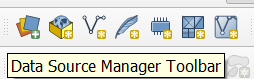
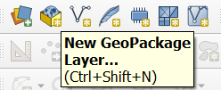
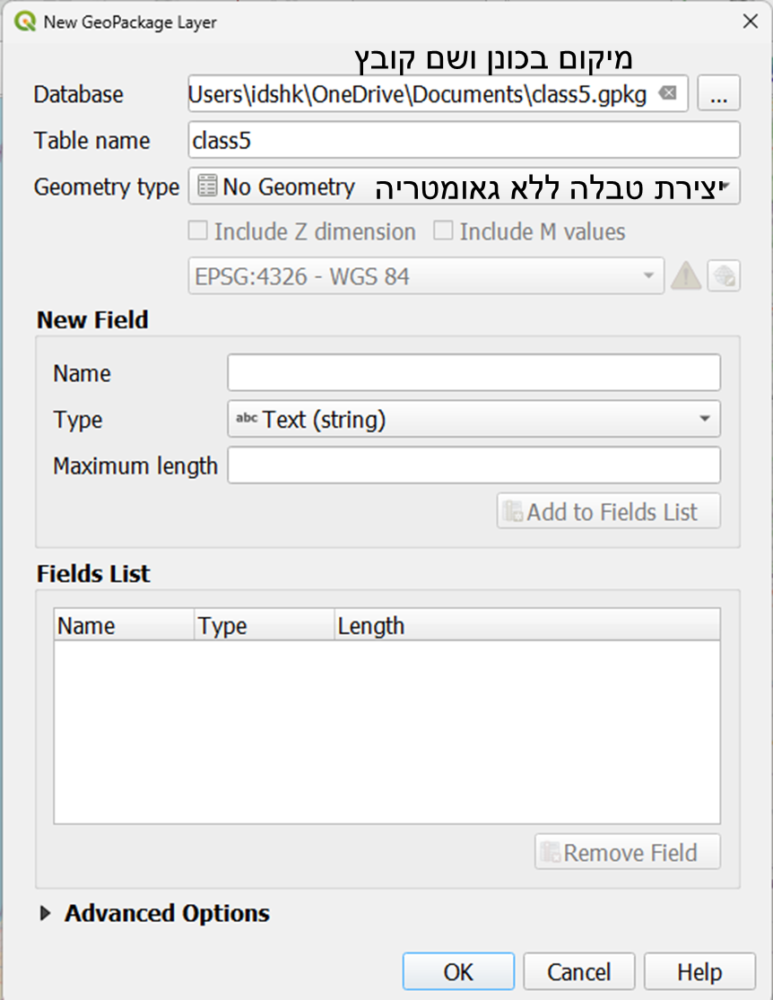
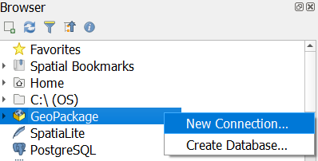
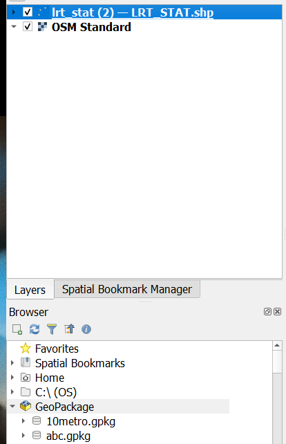
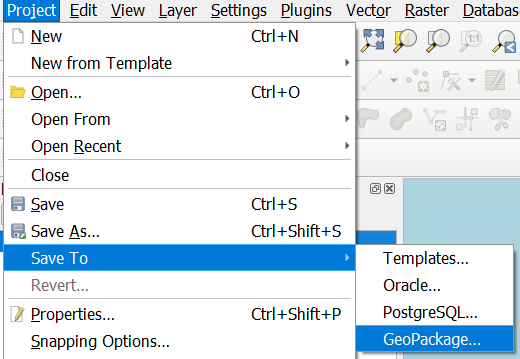
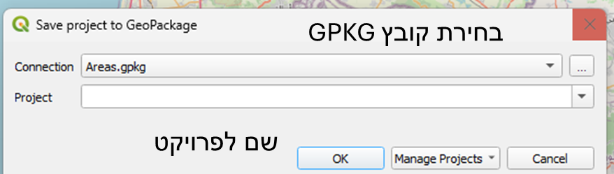
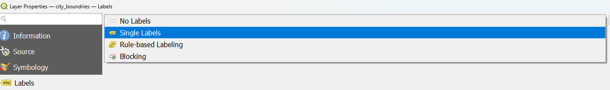
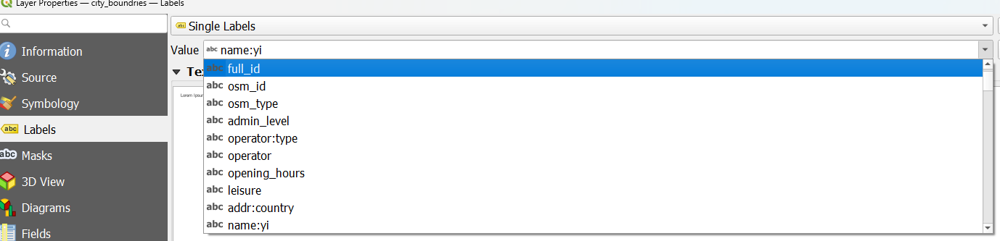
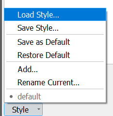

```{ojs}
//| echo: false
now = new Date
```

## תזכורת לשיעור הקודם

-   דיברנו על מפות כלליות, מפות נושאיות

## בשיעור היום

-   נלמד איך טוענים פרויקט מgpkg

-   נלמד איך לייצר GPKG

-   נלמד איך לייצר תוויות

-   נלמד איך לייצר סגנונות

## השלמת חובות - טעינת פרויקט מgpkg

קבצי GPKG הם קבצים בקוד פתוח, המאפשרים ניהול מלא של פרויקט מקובץ אחד, כולל שכבות, סגנונות, מפות ופרויקט.

בניגוד לשימוש בקבצי shp ותוספותיהם, אפשר לייצר קובץ gpkg עם מספר שכבות ופרויקטים.

## כיצד טוענים פרויקט?



## תרגול GPKG

-   נוריד שכבות מהאינטרנט

    -   [שכבת קווי הרק"ל](https://data.gov.il/dataset/lrt_line)

    -   [שכבת תחנות הרק"ל](https://data.gov.il/dataset/lrt_stat)

-   נייצר קובץ GPKG

-   נשמור לתוכו את השכבות

-   נשמור בתוכו פרויקט

## יצירת קובץ GPKG - הדגמה





------------------------------------------------------------------------

על מנת לאתחל קובץ gpkg, נייצר קובץ ריק שכזה



------------------------------------------------------------------------

### שמירת השכבות אל תוך הGPKG

יש כמה דרכים, בשיעור ניגע בכמה, במצגת - את הדרך הקלה:

נייצר חיבור חדש אל הGPKG (בחירת קובץ)



------------------------------------------------------------------------

נגרור את השכבות אל תוך הGPKG



------------------------------------------------------------------------

### שמירת הפרויקט לתוך הGPKG

נשמור פרויקט לתוך הGPKG -



------------------------------------------------------------------------

ניתן שם לפרויקט. יש אפשרות לשמור מספר פרויקטים בתוך GPKG אחד.



## תוויות {.smaller}

ניתן להוסיף תוויות בproperties של בשכבה, תחת labels. התוויות נקבעות לפי שם המשתנה בשכבה, בדומה לסימבולוגיה של שכבה.





--------------------------------------------------------------------------  

כלל יתר ההגדרות או מתקדמות ולא יכוסו בקורס זה, או דומות לסגנונות שניתן לתת במעבד תמלילים, כמו פונט, גודל פונט, מודגש/איטלקי/קו תחתון, צבע. לימוד יתר ההגדרות בזמנכם הפנוי.

## ניהול סגנונות

עבור כל שכבה, ניתן לשמור על מספר שונה של סגנונות. שמירה על מספר שונה של סגנונות מאפשר יצירת סדר ותיעוד של תהליך העבודה.

## יצירת סגנון

שתי דרכים ליצירת סגנון:

בפאנל השכבות:

{width="377"}

------------------------------------------------------------------------

בתוך אפשרויות השכבה

{width="687"}

כאשר אתם נמצאים בתוך סגנון - הוא יישמר אוטומטית כל עוד תבצעו פעולות שינוי סגנון.

## החלפת סגנון

וכדומה בתוך אפשרויות השכבה

{width="316"}

## העתקת סגנון


ניתן להעתיק סגנון משכבה לשכבה במידה והעמודות זהות. למשל בין שתי שכבות לא קשורות בהכרח.

## ייבוא סגנונות

ניתן לייבא סגנונות מקבצי qml, המכיל בתוכו סגנון קבוע מראש -שבא לחסוך לנו הרבה עבודה.

איך נראה קובץ qml?

{width="214"}

------------------------------------------------------------------------

בקובץ qml יש הגדרות שונות לסגנון המאפשרות ייצוג שונה של ישויות בשכבה.

## סגנון מבאת לדוגמא

הדגמה מאתר [קווים כחולים](https://ags.iplan.gov.il/xplan/)

[הורידו את הסגנון מכאן](https://www.gov.il/he/departments/general/symbology_qgis)  

------------------------------------------------------------------------  





## תרגיל

השבוע לא יינתן תרגיל