```{ojs}
//| echo: false
now = new Date
```

## תזכורת לשיעור הקודם

-   למדנו איך טוענים GPKG

-   למדנו איך מייצגים שכבות

## בשיעור היום

-   נלמד איך לנהל סימניות מרחביות

-   נלמד איך לנהל תמות

-   נלמד איך לנהל מפות

## היגיון של השיעור הנוכחי

על מנת לייצר מפה, אנו זקוקים ל3 אלמנטים מרכזיים:

שכבות להצגה, בסגנון מסוים (על סגנונות למדנו בשיעור הקודם, אבל נרענן גם עכשיו)

תיחום להצגה

אלמנטים קרטוגרפיים

## ניהול סגנונות

עבור כל שכבה, ניתן לשמור על מספר שונה של סגנונות. שמירה על מספר שונה של סגנונות מאפשר יצירת סדר ותיעוד של תהליך העבודה.

## יצירת סגנון

שתי דרכים ליצירת סגנון:

בפאנל השכבות:

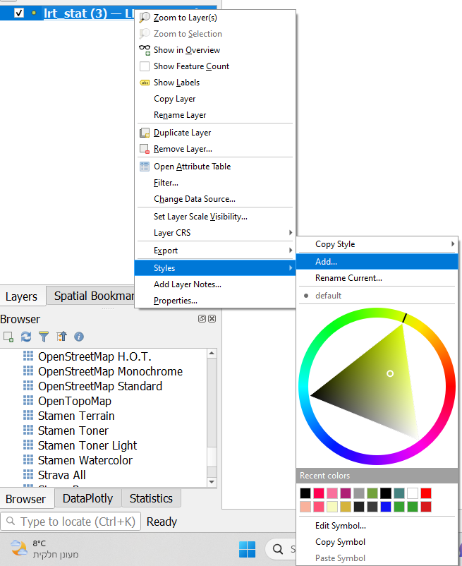{width="377"}

------------------------------------------------------------------------

בתוך אפשרויות השכבה

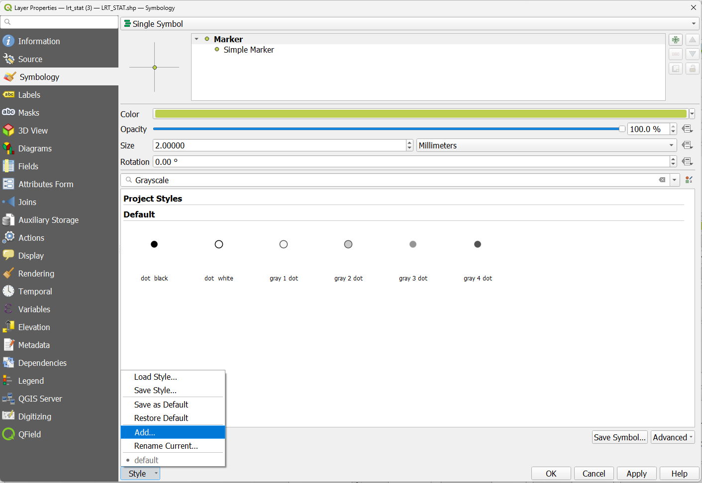{width="687"}

::: callout-note
## שימו לב

כאשר אתם נמצאים בתוך סגנון - הוא יישמר אוטומטית כל עוד תבצעו פעולות שינוי סגנון.
:::

## החלפת סגנון

וכדומה בתוך אפשרויות השכבה

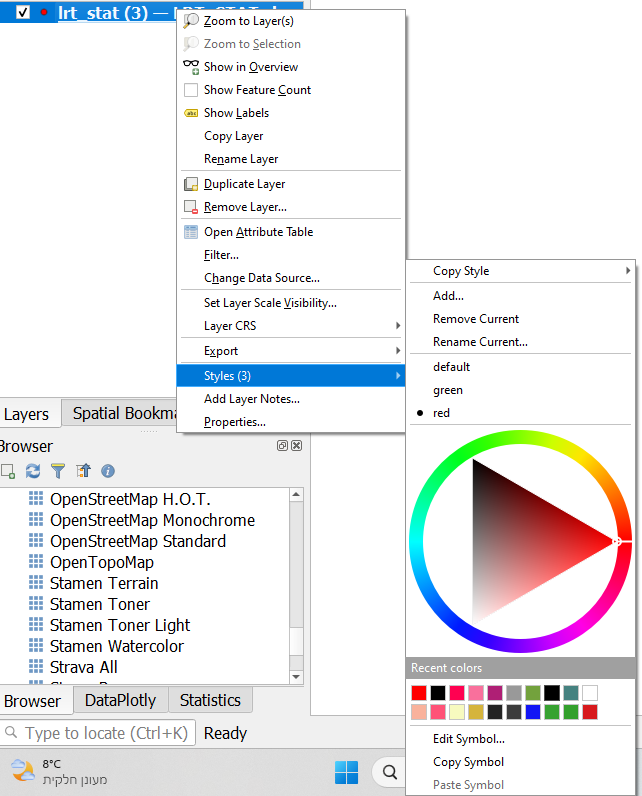{width="316"}

## ניהול סימניות מרחביות

סימניה מרחבית מאפשרת לחזור שוב ושוב לאותו תיחום של המפה

## יצירת סימניה מרחבית

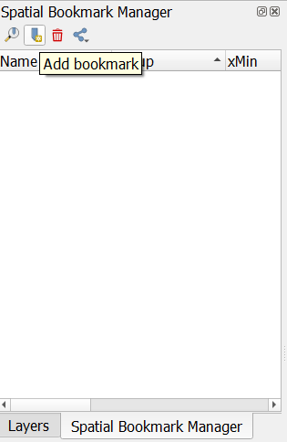

------------------------------------------------------------------------

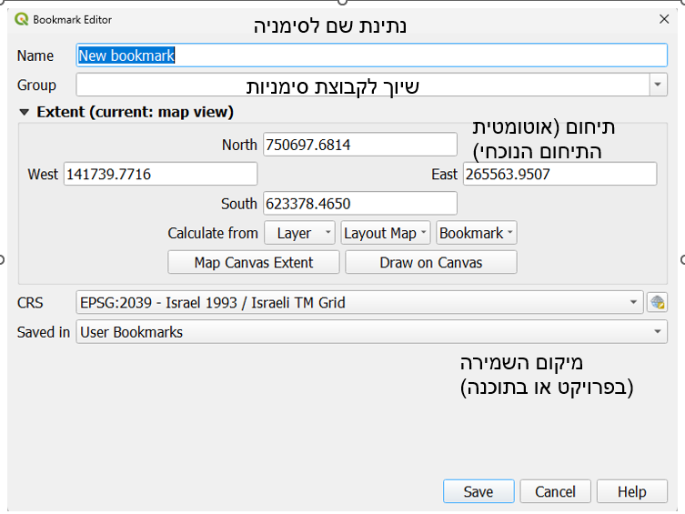

## תמות

theme הוא מצב של התוכנה, בו חלק מהשכבות מודלקות על סגנון מסוים. הוא מאפשר יצירה מחודשת של מפות בצורה מדויקת, ביחד עם סימניות מרחביות.

## יצירת תמה

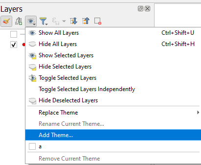

## ניהול תמות

החלפת תמה מתבצעת על ידי לחיצה על התמה בשם אחר מזה שנתתם.

## יצירת מפות

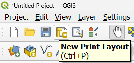{width="220"}

יש לתת שם ללייאוט בדיאלוג שייפתח. בפאנל הצידי ניתן לשלוט באובייקטים השונים במפה.

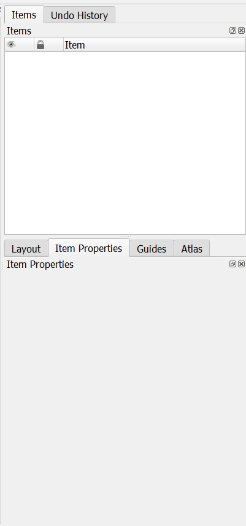{width="242"}

## אלמנטים קרטוגרפיים

בפאנל הצידי השני (או בתפריט add item) ניתן להוסיף אלמנטים למפה, כמו מפה, מקרא, חץ צפון, קנה מידה, טקסט ועוד המון. נתעכב על החשובים ביניהם:

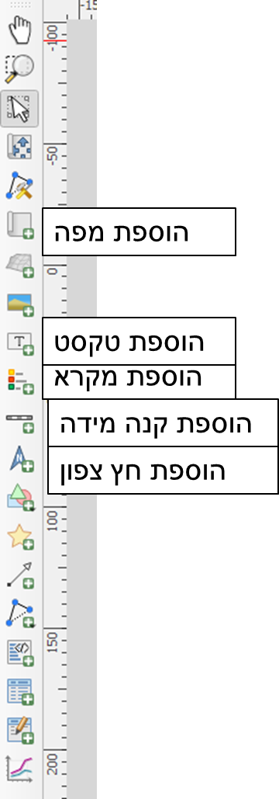{width="280"}

## מפה

הוספת מפה תתן לי את המבט שאני רואה על הקנבס של התוכנה כעת. תזוזה תשנה את תצורת המפה.

על מנת להגיע למפה בת שחזור, אני צריך לקבוע שתי הגדרות - תמה(באדום), וסימניה מרחבית (בירוק). קיבוע זה מאפשר לי שחזור מדוייק של יצירת המפה.

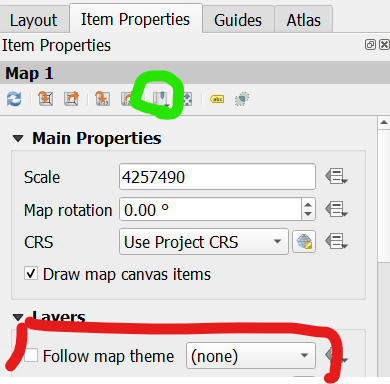

## מקרא

המקרא כברירת מחדל יתן לי את כלל השכבות המוצגות. אני יכול לשלוט בו בתפריט item properties.

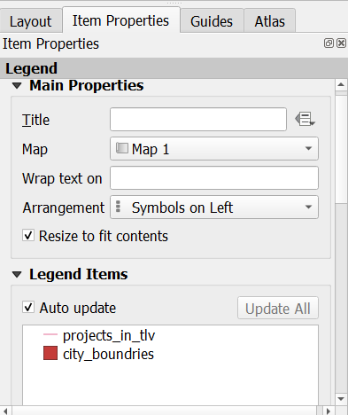

## עזרי התמצאות

חץ צפון

קנה מידה

## מידע נוסף

כותרת

מידע בנוגע למפה

מקורות מידע עליהם המפה מתבססת

## ניהול מפות

במידה וייצרתי יותר ממפה אחת, יש לי אפשרות לדפדף בין מפות. ניתן להיכנס למנהל המפות דרך החלון הראשי או דרך חלון הלייאוט (אותו סמליל). ניתן לבחור מפה לפתיחה עם לחיצה כפולה, לשכפל מפה, לשנות שם או למחוק.

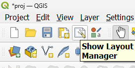

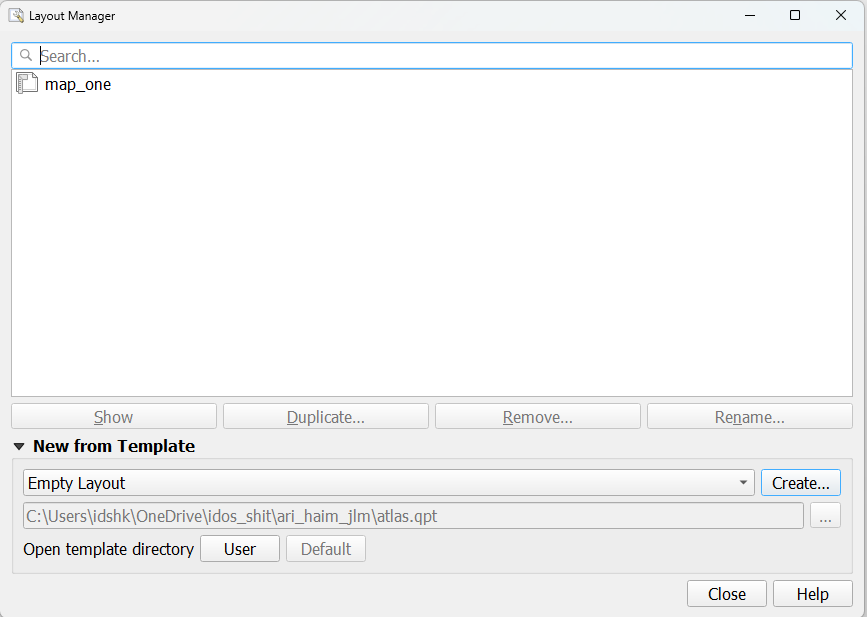{width="329"}

## תרגיל 5 {.smaller}

1.  הורידו מהאתר את הGPKG

2.  פתחו את פרויקט proj

3.  השקיפו את המילוי של שכבת city_boundries והוסיפו תווית לשם העיר

4.  יצרו שני סגנונות לשכבה projects_in_tlv - לפי סוג תשתית ולפי חברה הבונה את התשתית. שמרו את הסגנונות בתוך השכבה

5.  ייצרו את תמה type שיש בה את שכבת הפרויקטים בתל אביב עם סגנון סוג התשתית ללא שכבת הערים, ותמה city_company שיש בה את שכבת הערים ושכבת הפרוקיטים עם סגנון החברה הבונה

6.  יצרו שתי סימניות מרחביות בקנה מידה של 1:10000 ו1:5000. קראו להן בשם הקנה מידה. שמרו אותן בפרויקט.

7.  יצרו שתי מפות - אחת עם תמה הראשונה עם ה1:10000 ואחד עם התמה השנייה עם ה1:5000

8.  שמרו את המפות בתוך הפרויקט והגישו חזרה את הgpkg (זכרו לא להחליף את שם הקובץ)