```{ojs}
//| echo: false
now = new Date
```

## תזכורת לשיעור הקודם

-   למדנו איך לייצר מפות בצורה ברת שחזור

## בשיעור היום

-   נלמד איך להתעסק עם מידע בQGIS

-   נלמד לנהל את טבלת הישויות

-   נלמד לבחור ישויות בצורה ידנית - טבלאית ומרחבית

-   נלמד לבחור ישויות בעזרת שאילתא - טבלאית ומרחבית

-   נלמד לייצא שכבות מתוך בחירה

## מטרת השיעור

על מנת לעבוד עם מידע מרחבי, יש צורך בבחירת המידע הרצוי לצורך המסוים.\
שכבות מידע לרוב מכילות כמויות גדולות של מידע, ולעיתים מה שנזקק לנו זה רק חלק ממנו.\
החלק הזה יכול להיות חלק שקשור לקטגוריה שלא קשורה למרחב, או שכן קשורה אליו. הכל לפי הצורך שלנו.

## טבלת הישויות - פתיחה

טבלת הישויות ניתנת לגישה על ידי לחיצה על השכבה בפאנל השכבות -\> show attribute table

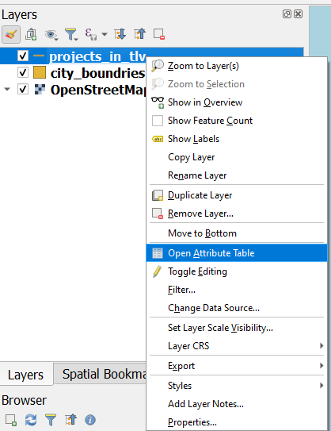

## טבלת הישויות - מראה בסיסי

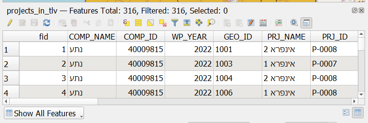

## כותרת

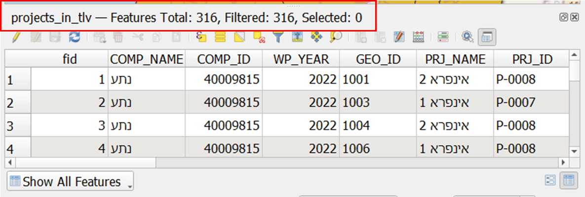{width="756"}

שם השכבה, כמות ישויות כוללת, כמות ישויות מסוננת, כמות ישויות נבחרת

## החלפה למצב הצגה ככרטיסיות

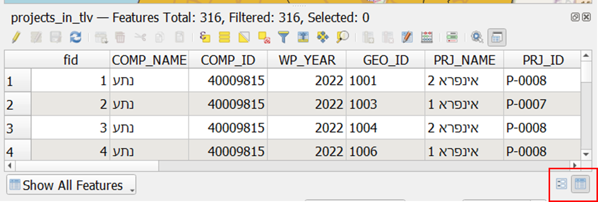{width="754"}

## הצגה ככרטיסיות

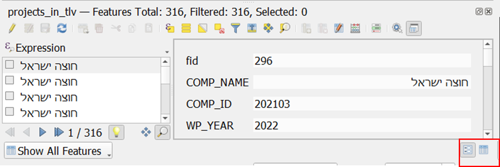{width="758"}

## בחירה ידנית של ישויות בטבלה

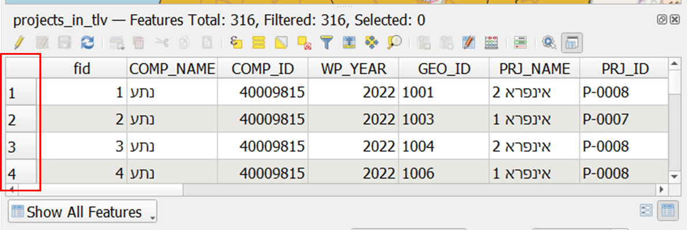{width="758"}

לחיצה על מספר השורה תוביל לבחירת הישויות.

## דוגמא לישות בחורה - בטבלה ובמפה

בטבלה, ברירת המחדל הוא סימון בכחול

במפה, הישות תצבע בצבע צהוב

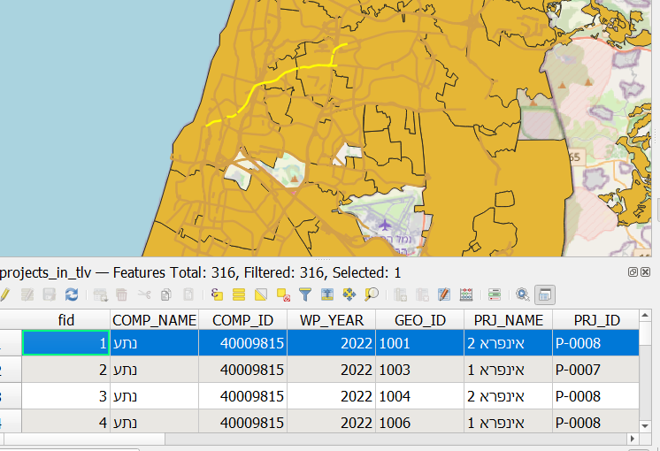

## בחירת תצוגת ישויות

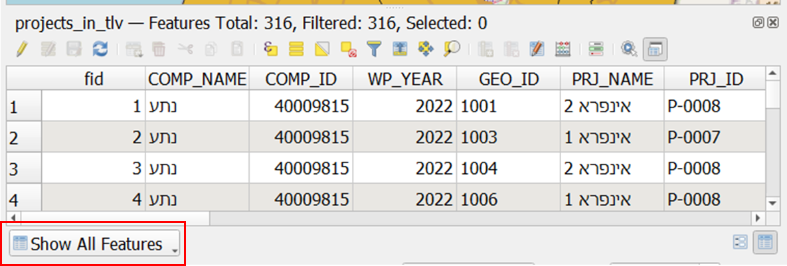{width="754"}

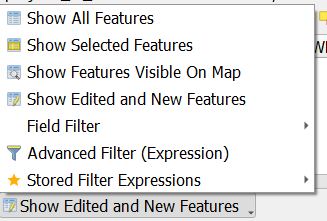

------------------------------------------------------------------------

ברירת המחדל היא צפייה בטבלה בכל הישויות.

ניתן גם לאפשר צפייה בטבלה בישויות נבחרות בלבד

בישויות הנצפות על המפה

(במצב עריכה) בישויות נערכות/חדשות בלבד

בסינון על פי שדה

בסינון מתקדם (לא יכוסה בקורס זה)

## שליטה ברמת העמודה

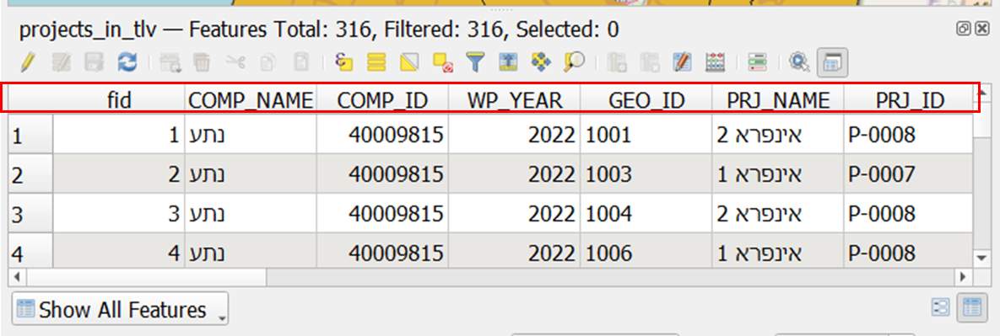{width="758"}

לחיצה על העמודה תסדר את הערכים בסדר עולה/יורד

## תוכן הטבלה {.smaller}

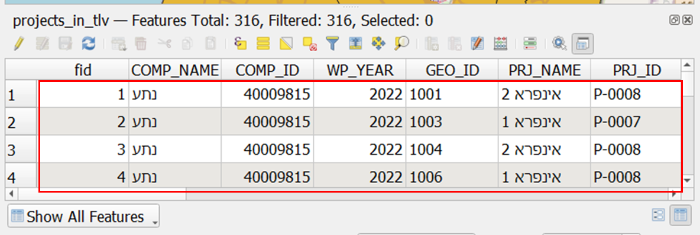{width="756"}

------------------------------------------------------------------------

לחיצה על כפתור ימני תאפשר 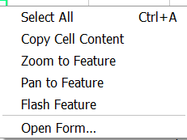:

בחירה בכל הישויות

העתקת המידע בתא

התמקדות לישות

מעבר באותה רמת זום למרכוז הישות

הבהוב הישות

פתיחת הכרטיסיה

## סרגל הכלים בטבלת הישויות

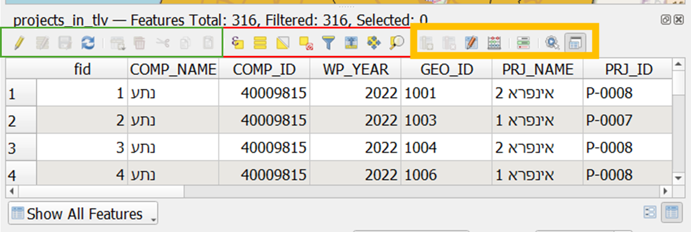{width="758"}

::: {style="font-size: 50%;"}
בירוק - עריכה (נלמד בשיעורים הבאים)

באדום: בחירה לפי ביטוי (לא יכוסה בקורס)

בחירת כלל הישויות\|הפיכת הבחירה הקיימת\|ביטול כלל הבחירה הקיימת בשכבה

בחירה באמצעות כרטיסיות\|העברת הישויות הבחורות למעלה\|גלילה למרכז הישויות הבחורות באותה רמת זום\|

בכתום - כפתורים הקשורים להוספת שדות/כפתורים מתקדמים שלא ילמדו במסגרת הקורס.
:::

## בחירה ידנית במפה

בחירה ידנית בטבלה כוסתה במסגרת הלימוד על טבלת הישויות.

בחירה ידנית במפה מתבצעת בסיוע של סרגל הבחירה

## סרגל הבחירה

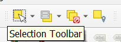

לחיצה על הכפתור בצד שמאל מאפשרת בחירה על גבי המפה. ברירת המחדל היא בחירה באמצעות מלבן, ניתן להחליף לבחירות מסוגים אחרים (לא מאוד חשוב לצרכי קורס זה).

הכפתור השני משמאל למעשה משחזר כפתורים הקיימים בסרגל טבלת הישויות.

הכפתור השלישי משמאל מאפשר לבטל בחירה מהשכבה המסומנת כרגע בקו תחתון ובולד (השכבה הפעילה), או מכלל השכבות.

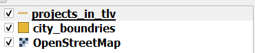

הכפתור הרביעי מאפשר בחירה על פי מרחב.

## שאילתא טבלאית

ביצוע שאילתות טבלאיות מזכיר מאוד את השימוש באפשרות הפילטר באקסל -

עבור כל עמודה יש סט ערכים מסוים שאמור לעמוד בקריטריון מסוים.

במידה ויש לי טבלה בה רשומים תלמידי הכיתה, מגדרם וגובהם, אני יכול לסנן את כלל התלמידים שמגדרם זכר וגובהם יותר מ180 ס"מ.

יש כאן שני סינונים על שתי עמודות:

מגדר = זכר

גובה \>180 ס"מ.

באמצעות שאילתות מהסוג הזה ניתן למקד את הנתונים הדרושים לנו לצרכינו השונים.

## חלונית סינון בחירה

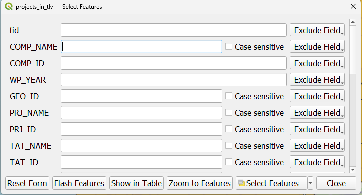

חלונית זו קיימת גם בטבלת הישויות. עבור כל עמודה - ניתן לבחור יחס עבור הערך המצוין.

היחס משתנה לפי סוג המשתנה - עבור טקסט ניתן לבצע פעולה השוואה טקסטואליות. עבור מספרים - גם השוואה בין ערכים מספריים.

------------------------------------------------------------------------

בשורה התחתונה ניתן לבחור האם לבטל את הערכים שציינו, להבהב את הישויות העונות לתנאי, להראות את הישויות בטבלת הישויות, להתמקד אל הישויות. ולבצע בחירה של הישויות -

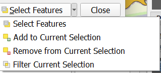

על ידי בחירה פשוטה, הוספה לבחירה הקיימת, הפחתה מהבחירה הקיימת, או לבצע סינון על פי הבחירה הקיימת.

## מה בין בחירה וסינון

כאשר מסננים - הישות שסוננה החוצה לא נמצאת בטבלה או על גבי המפה.

כאשר בוחרים - יש סימון של הישות הבחורה בטבלה (בכחול) ובמפה (בצהוב).

למה?

לפעמים זה יותר נוח, לפעמים זה יותר נוח. אין תשובה מוחלטת.

## דוגמא - הדגמה בכיתה

מצאו את כלל הפרויקטים המבוצעים על ידי חברת נתיבי ישראל לתחצ.

## בחירה מרחבית

בחירה מרחבית למעשה מאפשר הצלבה בין שכבות, והיחסים המרחביים שלהם.

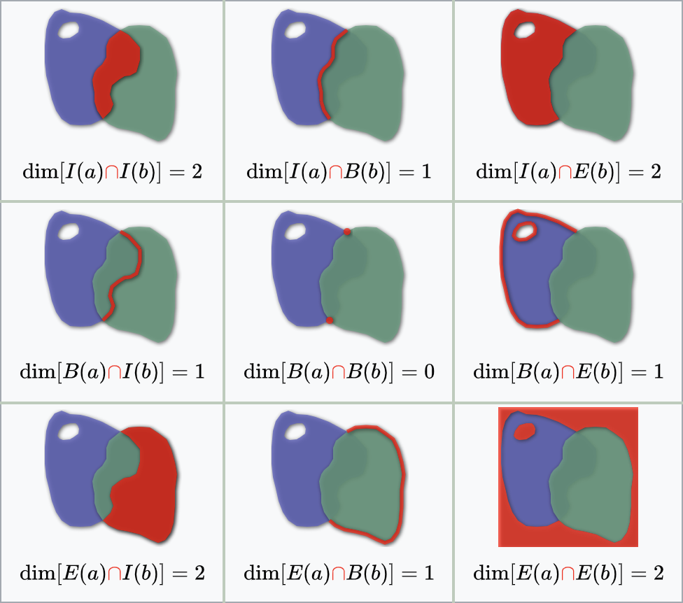{width="717"}

## יחסים מרחביים - מה הם?

בדיקה בין שתי ישויות - האם הן חופפות? זהות? מוכלות אחת בתוך השנייה? מצטלבות?

יש הרבה מאוד סוגים (ליתר דיוק, 512) אפשריות ליחסים מרחביים. בחלונית הבחירה של השאילתא המרחבית יש לנו 8:

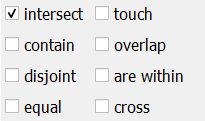

## הסברים על היחסים המרחביים {.smaller}
- מצטלבים (Intersect) — שתי ישויות חולקות לפחות נקודה אחת; כל חפיפה אפשרית.
- הכלה (Contain) — ישות A מכילה את ישות B במלואה (B נמצא כולו בתוך A).
- בתוך (are Within) — ההיפוך של "מכילה": ישות A נמצאת כולה בתוך ישות B.
- זהות (Equal) — שתי הישויות חופפות בדיוק זה לזה במיקום ובצורה.
- נוגעות (Touch) — הישויות נפגשות בקצה או בקו ללא חפיפה פנימית.
- חופפת חלקית (Overlaps) — יש חפיפה חלקית בין שתי ישויות כאשר אף אחת לא כוללת את השנייה במלואה.
- חוצה (Crosses) — ישויות חוצות זו את זו כך שהאינטראקציה משנה ממד (למשל קו שחוצה פוליגון).
- נפרדת (Disjoint) — אין חיבור, נגיעה או חפיפה בין הישויות.
חלונית הבחירה מאפשרת לנו לבחור את כלל הישויות משכבה אחת, בהשוואה שלהן לשכבה אחרת עבור היחס המרחבי האמור.

-------------------------------------------------

{width="600"}  

עבור שתי סוגי השכבות, ניתן להגביל את הבחירה לישויות שכבר נבחרו בכל אחת מהשכבות.

## דוגמא - הדגמה בכיתה

מצאו את כל הפרויקטים המתרחשים בעיר הרצליה על ידי חברת נתע.

## ייצוא שכבות

ניתן לייצא את השכבות לפורמטים אחרים, כמו אקסל או csv, או פורמט מרחבי אחר, על ידי כפתור ימני על השכבה - export- save features as

עבור ישויות שנבחרו, ניתן לייצא שכבה עם הישויות הבחורות בלבד, על ידי לחיצה בכפתור ימני על השכבה בחלון השכבות - export- save selected features as

## חלון ייצוא השכבות

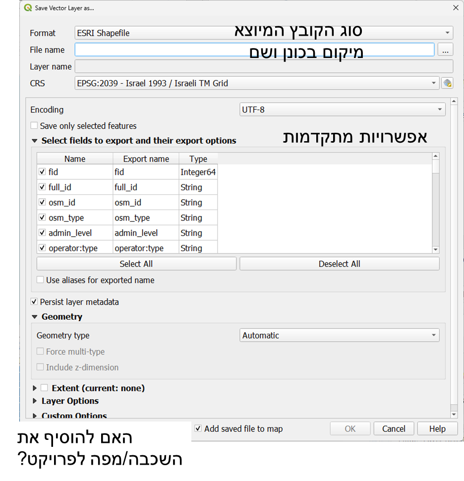{width="700"}

## תרגיל 6

1.  הורידו מהאתר את הGPKG מהתרגיל הקודם.

2.  פתחו את פרויקט proj

3.  בחרו את הפרויקטים בעיר רמת גן המתבצעים על ידי חברת נתיבי איילון.

4.  יצאו את הפרויקטים לטבלת אקסל או לקובץ CSV

5.  בדקו שבאפשרותכם לקרוא את הכתוב בקובץ והגישו אותו