```{ojs}
//| echo: false
now = new Date
```

## תזכורת לשיעור הקודם

-   למדנו איך לבחור ישויות, טבלאית ומרחבית, ידנית ובאמצעות שאילתא

## בשיעור היום

-   נלמד איך לערוך מידע בשכבה קיימת

-   נלמד איך לייצר שכבה חדשה

-   נלמד איך לעשות דיגטציה לישויות מרחביות

## הקדמה - סוגי מידע בעמודות  {.smaller}

כשמייצרים טבלה, יש חשיבות גדולה לסוג המידע אותו מגדירים בכל עמודה.

בשיעור הקודם למדנו לסנן ולבחור לפי טקסט או מספר. מחשבים מחזיקים סוגים שונים של מידע. מספר או טקסט הם למשל שני סוגים שונים. גם תאריך הוא סוג. גם גאומטריה.

בתוכנה כל סוג מידע בנוי אחרת מבחינת האחזקה שלו על המחשב, על מנת שיתפוס כמה שפחות מקום, ויאפשר עבודה כמה שיותר פשוטה עליו.

אי לכך, ממש חשוב להגדיר כמו שצריך את סוג העמודה אותה אנו צריכים.

## עריכה

כיצד נערוך? שתי אפשרויות: לחיצה על העיפרון בסרגל העריכה תאפשר עריכה על השכבה הפעילה

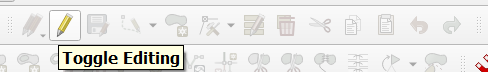

פתיחת טבלת הישויות ולחיצה על העיפרון תאפשר עריכה

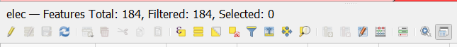

שני הסוגים קצת שונים - הראשון מיועד יותר לעריכה גאומטרית, השני לעריכה טבלאית, אבל שני הסוגים יעבדו עבור כל סוגי העריכות.

## תוכן תא

במצב עריכה ניתן לשנות תוכן של תא, בהתאם לסוג המידע הקיים בתא. למשל, לא ניתן לשים טקסט בתא מסוג מספר.

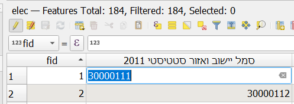

## הוספת עמודה

לחיצה על הכפתור תאפשר הוספת עמודה

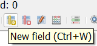

חובה לתת שם וסוג. ההערה לא מאוד חשובה. אורך העמודה יכול להיות חשוב, אם כי כשמגדירים אותו כ0 - אין מגבלה אפקטיבית על האורך.

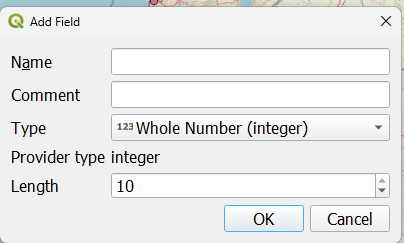

------------------------------------------------------------------------

בחירת סוג העמודה היא אחת מיני רבות - ה6 הראשונות הן אלו שבעיקר יעניינו אותנו - מספר שלם, מספר עשרוני, טקסט, תאריך, זמן, תאריך וזמן

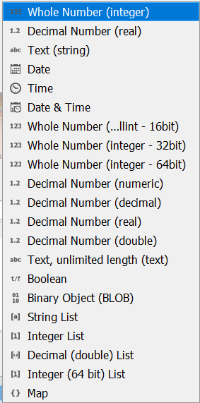

## מחיקת עמודה

במידה ואנו מעוניינים למחוק עמודה (לא מומלץ ללא גיבוי כלשהו), ניתן ללחוץ על:

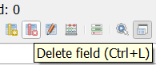

שיאפשר בחירה של עמודות למחיקה. שוב - לא מומלץ.

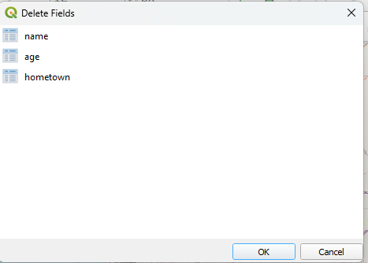

## שינוי שם עמודה

שינוי שם עמודה לא אפשרי בקלות דרך טבלת הישויות, אבל אפשרי - דרך הגדרות השכבה. לחיצה על העריכה שם, או כניסה להגדרות במצב עריכה, תאפשר גם את שינוי שם העמודה.

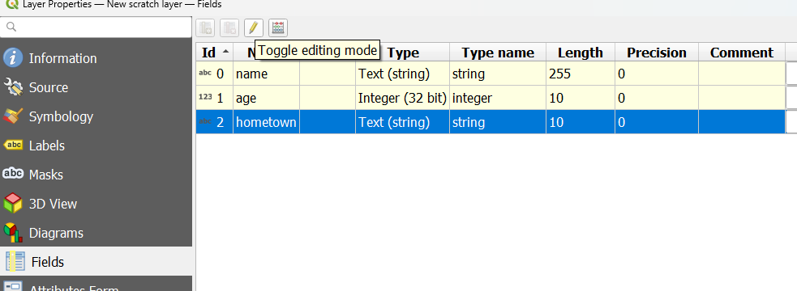

## שמירה

הפסקה - לפני הוספת ומחיקת שורות - כיצד ניתן לשמור את השכבה? גם כאן, שתי דרכים:

כפתור בפאנל

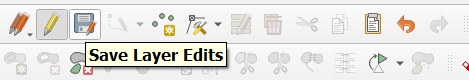

כפתור בטבלת הישויות

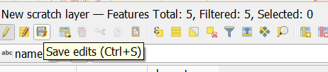

## יציאה ממצב עריכה

גם כאן, שתי דרכים:

כפתור בסרגל

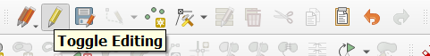

כפתור בטבלת הישויות

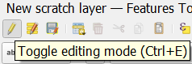

----------------------------------------------------   

::: {.callout-note}
שימו לב! במידה וניסיתם לצאת ממצב עריכה לפני ששמרתם על השכבה, התוכנה תשאל אתכם אם אתם רוצים לשמור. ניתן לא לשמור, וניתן לבטל.
:::

## הוספת שורה

ניתן להוסיף שורה, כהרגלנו, בשתי דרכים, רק שכאן זה נהיה קצת יותר מורכב:

דרך סרגל העריכה

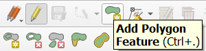

דרך טבלת הישויות

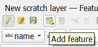

------------------------------------------------------------------------  

::: {.callout-note}
שימו לב! הוספה דרך כל אחת מהדרכים הינה מאוד שונה.   
הוספה דרך סרגל העריכה תכניס אתכם למצב עריכה של ישות גאוגרפית - "דיגיטציה" (ועל כך בהמשך).   
הוספה דרך טבלת הישויות תוסיף שורה ריקה ללא גאומטריה, את הגאומטריה יהיה ניתן להוסיף בהמשך בעזרת add part בסרגל עריכה מתקדמת. השימוש בadd part קל לכשמכירים את add feature.
:::   

לרוב כשמייצרים שכבות נהוג להשתמש בסרגל העריכה, אבל זה תלוי במה עושים ומהי זרימת העבודה.

## מחיקת שורה

ניתן למחוק שורה על ידי בחירה ולחיצה על פח הזבל בטבלת הישויות. כמו בעמודות - יש להיזהר עם מחיקות, אם כי מחיקת שורה אינה משמעותית כמו מחיקת עמודה.

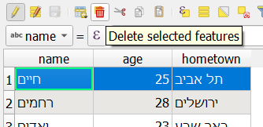

## יצירת שכבה חדשה {.smaller}

ישנן מספר דרכים להוסיף שכבה חדשה, באמצעות סרגל ניהול מקורות המידע:

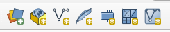

למעשה יש כאן שלוש אפשרויות רלוונטיות לנו בשלב זה:

יצירת שכבה חדשה בתוך gpkg

יצירת קובץ shp חדש

יצירת שכבה זמנית (לא נשמרת יחד עם הפרויקט או בקובץ).

כתלות בסוג העבודה, יש עדיפות ליצירת תוצרים ברי שמירה ושחזור, ולכן האפשרות הטובה ביותר היא יצירת שכבה בתוך GPKG. אבל גם שתי האפשרויות האחרות קבילות.

## סוג הגאומטריה של השכבה

בהתאם לסוג האפשרות שבחרתם, תוכלו גם לבחור את סוג השכבה הרצויה - לרוב נתמקד בנקודה, קו ופוליגון, אך יש לזכור שניתן גם לייצר רב-נקודה, רב-קו, רב פוליגון ועוד ישויות גאוגרפיות כמו עקומה שלא נלמד בקורס זה. ניתן לבחור את סוג הגאומטריה כאן:

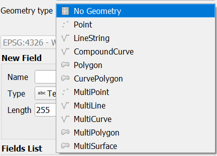

----------------------------------------------------------------  

אפשר גם להוסיף סתם טבלה. טבלאות סתם לא יכולות להפוך לשכבות אבל הן יכולות להתחבר לשכבות באמצעות צירוף טבלאי. נושא לזה יילמד במידה והזמן יתיר.  

## הוספת עמודות

ביצירת שכבה חדשה קיים דיאלוג המאפשר הוספת עמודות רבות, בדומה להוספה בשכבה קיימת.

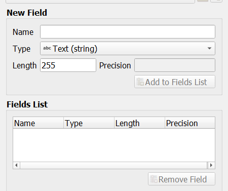

## דיגיטציה לסוגיה

יש להפריד את סוגי הדיגיטציה השונים לנקודה, קו ופוליגון, ברמה הבסיסית ביותר.

## נקודה

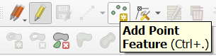

עבור שכבה נקודתית, הוספת הנקודות מתבצעת בצורה של לחיצה על המיקום במפה של הנקודה בה אתם מעוניינים. לאחר הלחיצה ייפתח דיאלוג של הוספת הרשומות לטבלה.

## קו

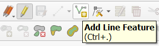

עבור שכבה קווית, יש לסרטט את כל מהלך הקו בו אתם מעוניינים. לסיום כפתור ימני. יפתח דיאלוג שישאל אתכם את יתרת השדות

## פוליגון

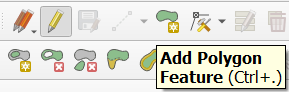

עבור שכבה פוליגוניאלית, יש לסרטט את כל מהלך הפוליגון, לסיום כפתור ימני, שיחבר את הנקודה הראשונה והאחרונה. יפתח דיאלוג שישאל אתכם את יתרת השדות

## עריכת ישות גאוגרפית

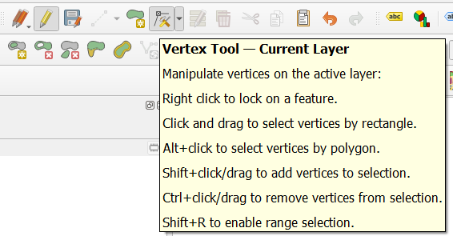

במידה וסיימתם לערוך ישות, אך אינכם מרוצים ממיקום הנקודות המרכיבות אותה - יש להשתמש בvertex tool על מנת לשנות.

כפתור ימני על הישות יפתח את טבלת הנקודות המרכיבות את הישות ויאפשר עריכתן.

------------------------------------------------------------------------

לחיצה שמאלית על אחד מהנקודות (המסומנות באדום) תאפשר הזזתן. לחיצה נוספת תקבע את הנקודה במיקום חדש.

גרירה שמאלית תאפשר בחירה של נקודות, delete במקלדת תאפשר מחיקה.

------------------------------------------------------------------------

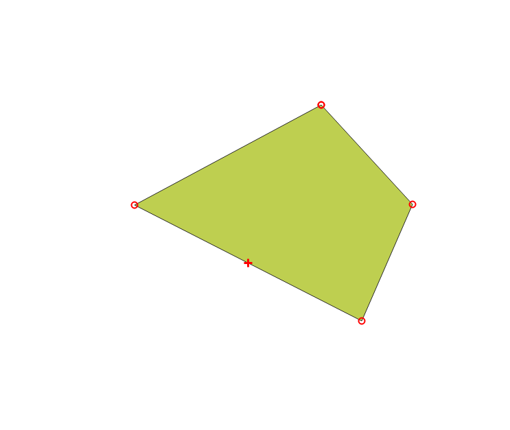

במידה ורוצים להוסיף נקודה באמצע מקטע, יש ללחוץ על הפלוס המופיע במרכז המקטע.

## עריכה מתקדמת

יודגם בכיתה.

## הצמדה

יודגם בכיתה.

## תרגיל 7

1.  מיפוי עצמי!
2.  צרו שכבה חדשה, של פוליגונים.
3.  הוסיפו בה 3 עמודות (לפחות) לבחירתכם, המתארות את הישות אותה אתם רוצים לסרטט
4.  הוסיפו בה 10 שורות (לפחות), המפרטות את המידע בו בחרתם
5.  שמרו את השכבה בתור קובץ GPKG

