```{ojs}
//| echo: false
now = new Date
```

## תזכורת לשיעור הקודם

-   למדנו איך לבצע לייצר שכבות חדשות ולערוך קיימות

## בשיעור היום

-   נלמד להשתמש בכלים בפאנל העיבוד

-   נלמד מספר פונקציות מרחביות ליצירת שכבות

## גאומטריה חישובית על קצה המזלג {.smaller}

עד כה, הדגמנו שאילתות או ניתוחים שלוקחים בחשבון בעיקר את העמודות הלא מרחביות בטבלה (למעט בבחירה לפי מיקום).

כעת, נרצה למנף את הכוח של מערכות המידע הגיאוגרפיות, ולבצע ניתוחים מורכבים יותר, שמתאפשרים לנו על ידי גאומטריה חישובית.

כשאני אומר גאומטריה חישובית, אני מתכוון לסט הפונקציות המתמטיות החישוביות שניתן לבצע על סט גאומטריות על מנת לבצע ניתוחים מרחביים.

תחום זה עמוק מאוד ולמעשה מהווה את סוס העבודה של השימוש בgis.

## למרות שהבטחנו שלא, נשתמש במילה - אלגוריתמים {.smaller}

אלגוריתם הוא למעשה מתכון המקבל קלטים, מבצע עליהם מניפולציה, ומוציא קלט.

עבור כל האלגוריתמים שנלמד, ושנמצאים בתוכנה, יש קלט -\> עיבוד -\> פלט.

בקלט נמצא לרוב שכבה, ופעמים רבות מאוד נצטרך גם להזין פרמטרים - הגדרות המסייעות לדיוק התוצאה שאנחנו נרצה מהאלגוריתם.

מבחינת העיבוד - מכיוון שזה קורס למתחילים - לא ניכנס לעומק אבל נסביר מה כל אלגוריתם עושה.

מבחינת הפלט - לרוב נקבל שכבה (לפעמים טבלה, לפעמים הפעולה תתבצע על שכבת הקלט).

## פאנל העיבוד

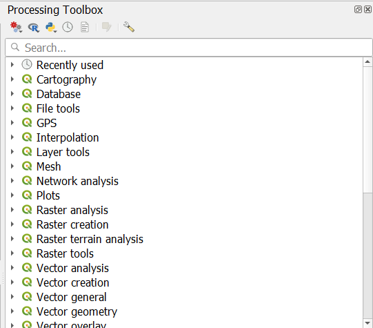

------------------------------------------------------------------------

ניתן גם באמצעות התפריט:

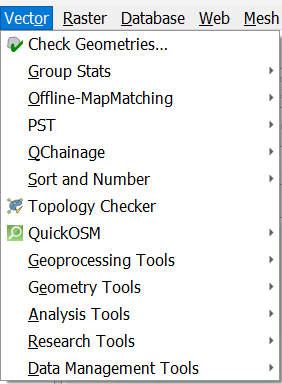

------------------------------------------------------------------------

## פעולות על שכבות בודדות

חלק מהפעולות שניתן לבצע על שכבות כוללות פעולות על שכבה אחת בלבד

ניתן להוריד את קובץ הcsv מהמודל.

הסיפור- אתם פקידי עירייה ואתם רוצים לדעת מיקום מרכזי הנמצא בין שתי תחנות אוטובוס, המשרתות שני צדדים של קו אוטובוס. אתם מניחים כי לא יכול להיות מקרה בו תחנות מקבילות נמצאות יותר מ100 מטרים אווירים אחת מהשניה.

------------------------------------------------------------------------

מה שנעשה זה שניקח את תחנות האוטובוס בקריית 8 ובסביבתה, נייצר חיץ של 50 מטרים סביבם, עבור כל חלק נפרד שאינו חופף נייצר ישות נפרדת, ואז נייצר נקודה המייצגת את מרכז הישות החדשה.

## תיאום ציפיות - ארוחת טעמים

אני לא מצפה שתדעו לבצע את כל מה שאנחנו עושים בשיעור היום. אנחנו הולכים לראות *הרבה* אלגורתמים מרחביים ושימוש שלהם, בשביל להבין איך עושים ניתוח מרחבי. סוג של מבוא. חשוב לזכור - זה דורש אפס ידע בקוד. רק הבנה של תהליכים וסדר.

## השלמת חוב - טעינת קובץ csv

csv - comma separated values, צורה אחרת לייצר טבלה. קבצים ברי פתיחה קלה באקסל.

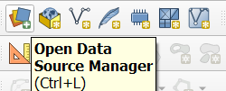

------------------------------------------------------------------------

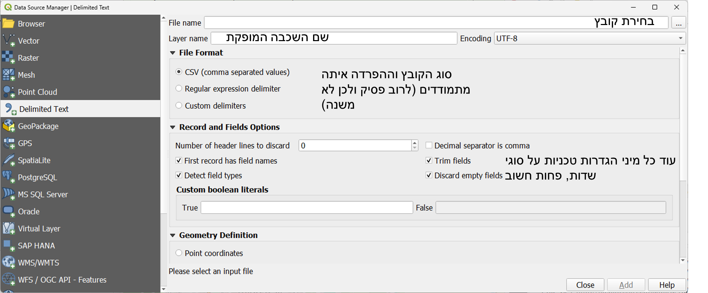

------------------------------------------------------------------------

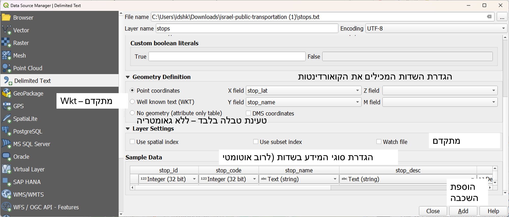

## טכני אבל חשוב - כלי המרת היטל שכבה {.smaller}

כזכור, למדנו על היטלים ומדידת מרחקים בתחילת הקורס. פעמים רבות נקבל מידע הקיים בwgs84, epsg:4326.

בגלל שהמידע בו קיים במעלות ולא במטרים, נתקשה לבצע עליו חישובים בהמשך. לכן אנו ממירים אותו לרשת ישראל החדשה, epsg:2039.

המרת היטלים היא פעולה מתמטית יחסית מורכבת להבנה, ולכן לא נתעמק בה; אבל בגדול מדובר בהמרה הפעולת על פענוח שלוקח בחשבון את עקמומיות הכדור והיחס בין ההיטלים.

ניתן לבצע את הפעולה על כל סוגי השכבות

------------------------------------------------------------------------

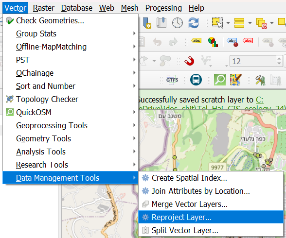

------------------------------------------------------------------------

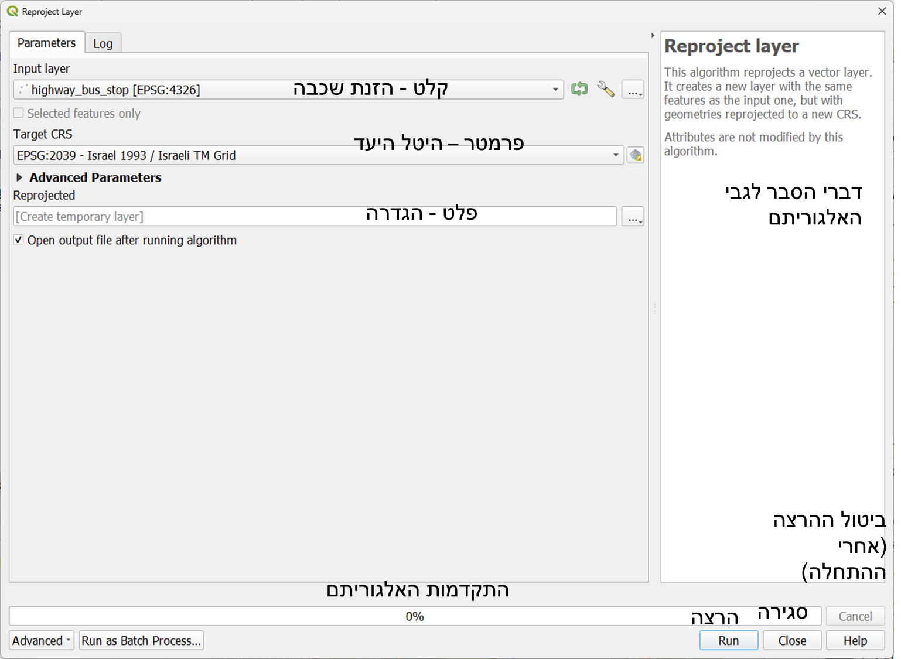

## רגע, מה קורה אחרי ההרצה?

תופיע לנו התוצאה של ההרצה בחלון השכבות.

נקודתית לגבי היטלים - ניתן לבדוק את היטל השכבה בריחוף מעל השכבה, או בproperties-\> source

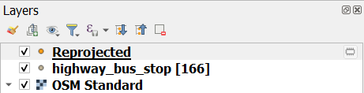

## חיץ

חיץ (הידוע יותר בשם buffer), היא אחת הפעולה היותר מוכרות בתוכנה. מה שמתרחש בפעולת הבאפר זה שמסורטט על ידי התוכנה האזור הנמצא מסביב לישויות השכבה עליה בוצע הבאפר.

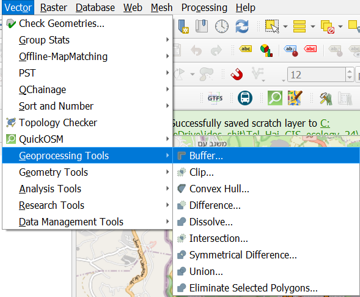

------------------------------------------------------------------------

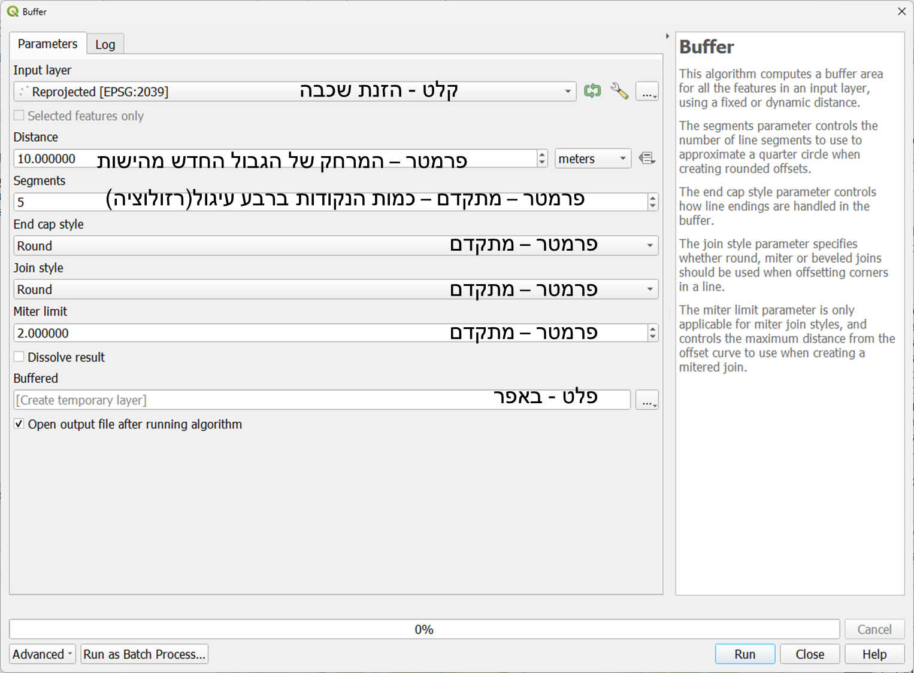

------------------------------------------------------------------------

הפלט לעולם יהיה פוליגון. ניתן לעשות באפר שלילי. יש באפרים לצד אחד. לא נדון בכך לעומק.

## טשטוש גבולות

נוצרו לנו 166 עיגולים בקוטר של 50 מטרים. אם נמצא את הנקודה המרכזית שלהם - נחזור פשוט לשכבה הקודמת שלנו. ולכן נאחד עם טשטוש גבולות

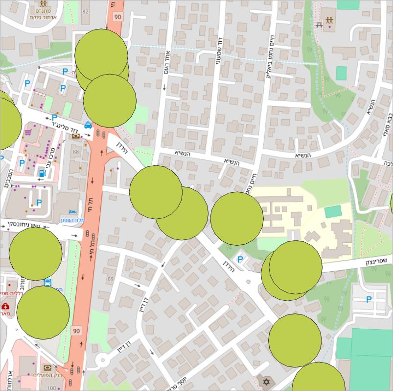{width="437"}

------------------------------------------------------------------------

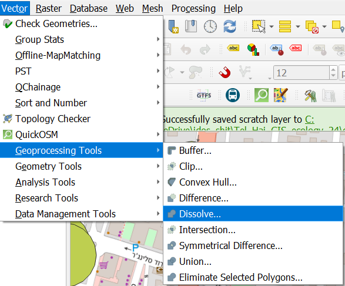

------------------------------------------------------------------------

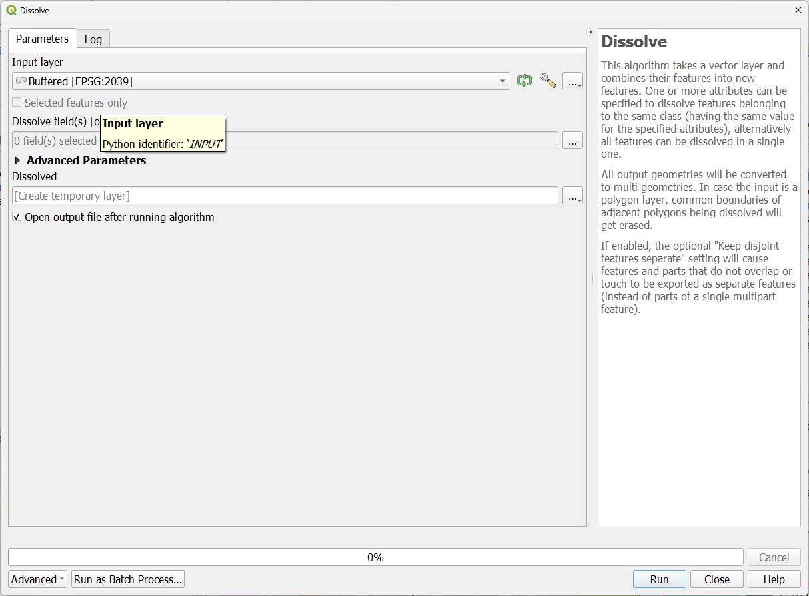

אין לנו מה להוסיף, למעט במקרים בהם נרצה לבצע את הטשטוש לפי שדה מסוים - נניח היו לנו תחנות של חברות אחרות, היינו מקבלים ישויות עבור כל חברה. כרגע נקבל ישות אחת. אבל אנחנו לא רוצים ישות אחת! מה נעשה?

## רב-חלקי לחד-חלקי

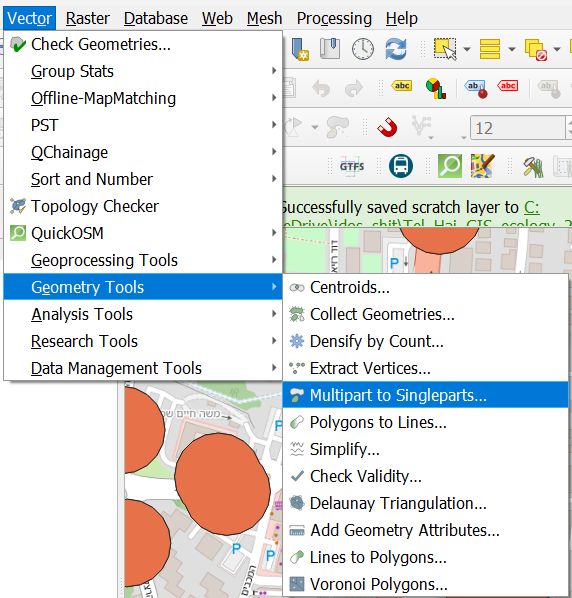

------------------------------------------------------------------------

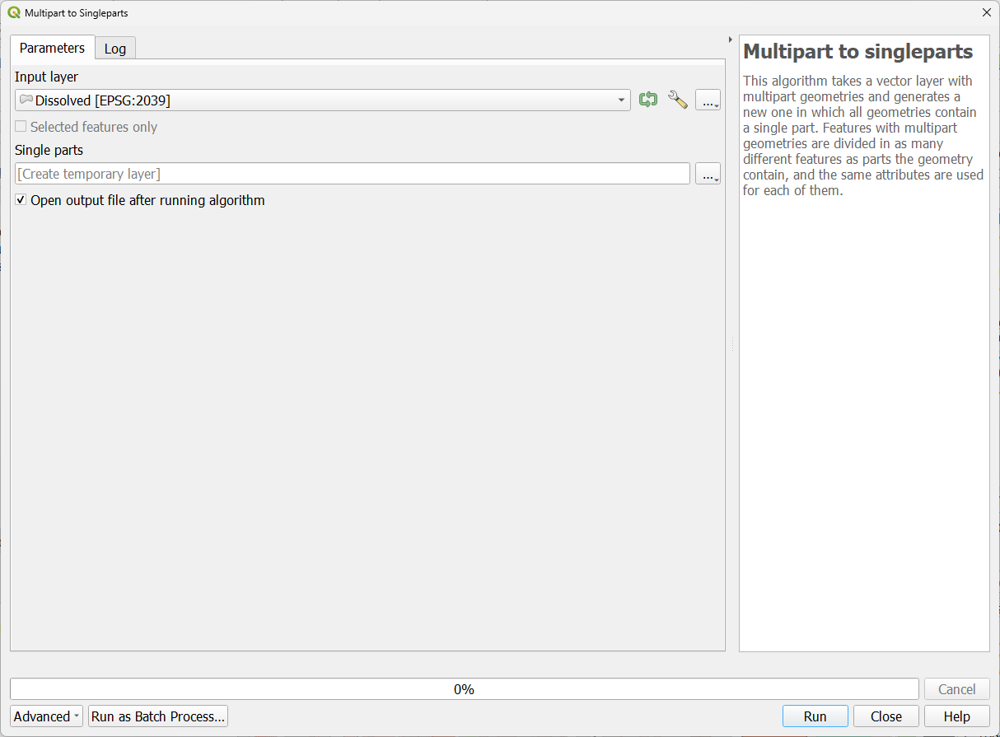

אלגוריתם מאוד פשוט, ללא פרמטרים - מפרק שכבה רב-(צורתית) לשכבה בה כל ישות היא צורה אחת בלבד.

## נקודות מרכזיות

לבסוף, ניקח את השכבה עם הצורות הבודדות, ונחשב עבורה את הנקודה המרכזית עבור כל פוליגון. חישוב הנקודה המרכזית מתבצע באמצעות נוסחה די פשוטה שלא תוסבר כאן.

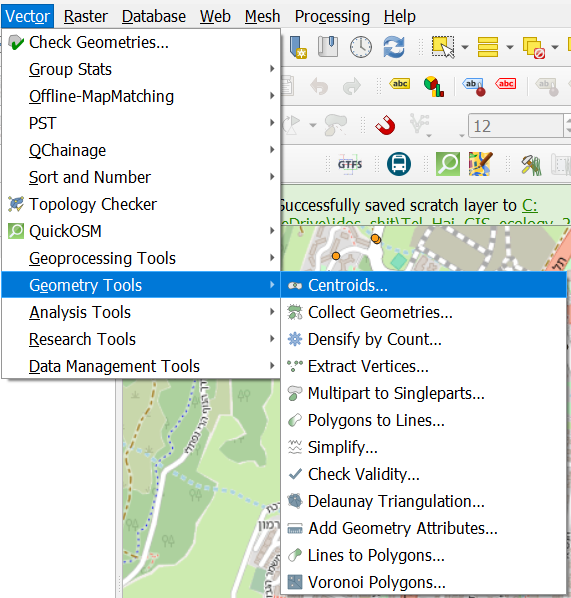

------------------------------------------------------------------------

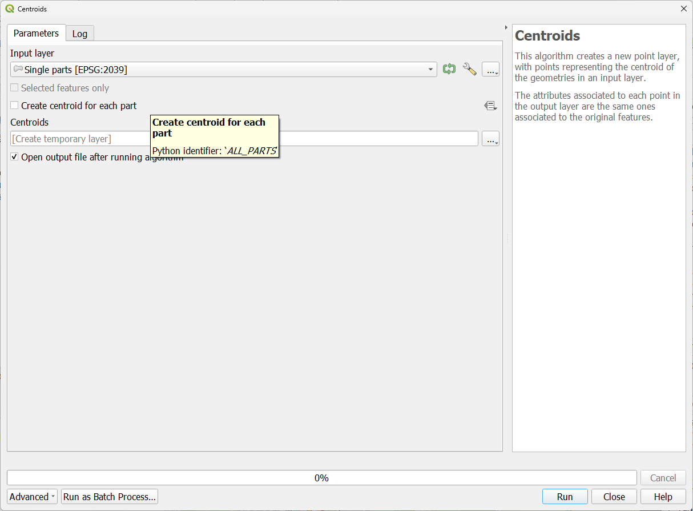

קיים פרמטר אחד- האם לייצר צנטרואיד עבור כל חלק,כאשר מדובר בשכבה רב-(צורתית).

## פעולות על מספר שכבות

המשימה שלכם שונתה! אתם רוצים לדעת עבור כל תחנת אוטובוס, לאיזה שכונה היא שייכת.

הורידו את קובץ הgpkg מהאתר בשביל לקבל את שכבת השכונות והתחנות.

(מעבר לרטוריקה שלי, נראה שניתן להזין יותר משכבה אחת לאלגוריתם בשביל לקבל פלט אחד. בתאוריה אפשר גם לקבל יותר מפלט אחד אבל זה באלגוריתמים יותר מתקדמים).

## ספירת נקודות בתוך פוליגון

נניח אנחנו רוצים לדעת בצורה כללית כמה תחנות יש בכל שכונה, איך נעשה זאת?

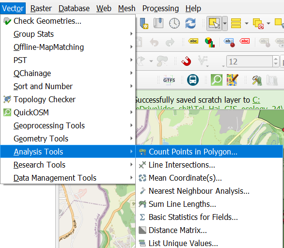

------------------------------------------------------------------------

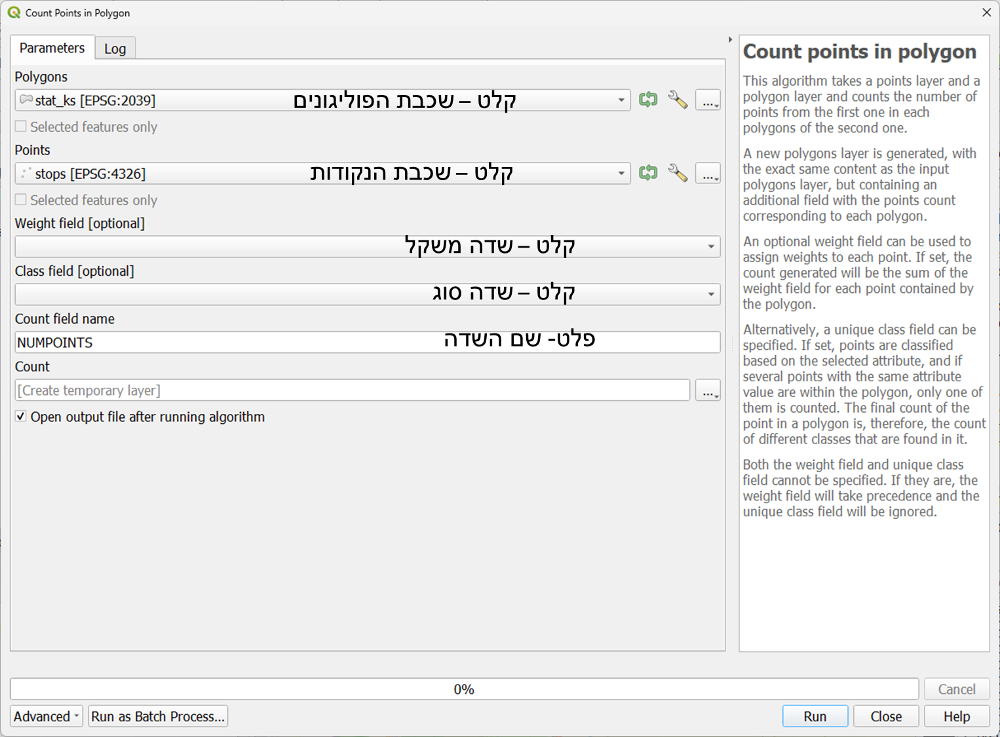

## צירוף שכבות

מהו צירוף? חיבור בין שתי ישויות המכילות ערך משותף בשדה מסוים.

צירוף, בשמו השני והיותר מוכר join, יכול להתבצע בשתי דרכים מרכזיות:

טבלאית - כאשר יש שדות טבלאיים פשוטים בהם ניתן למצוא את הערך המשותף

מרחבית - כאשר הגאומטריות של הישויות מקיימות יחס מרחבי מסוים

אנחנו רוצים לעשות צירוף מרחבי של כל תחנה (נקודה) - לאיזה שכונה (פוליגון) היא שייכת.

## צירוף מרחבי

ניתן להצמיד ישויות לפי היחס המרחבי ביניהן. היינו להגיד - עבור נקודות המצטלבות עם הפוליגון, עם איזה פוליגון הן מצולבות


------------------------------------------------------------------------


## הצלבה

ניתן גם לבצע יצירה של ישויות חדשות ושל הצטלבויות הגאומטריות שנמצאות בהן.


------------------------------------------------------------------------

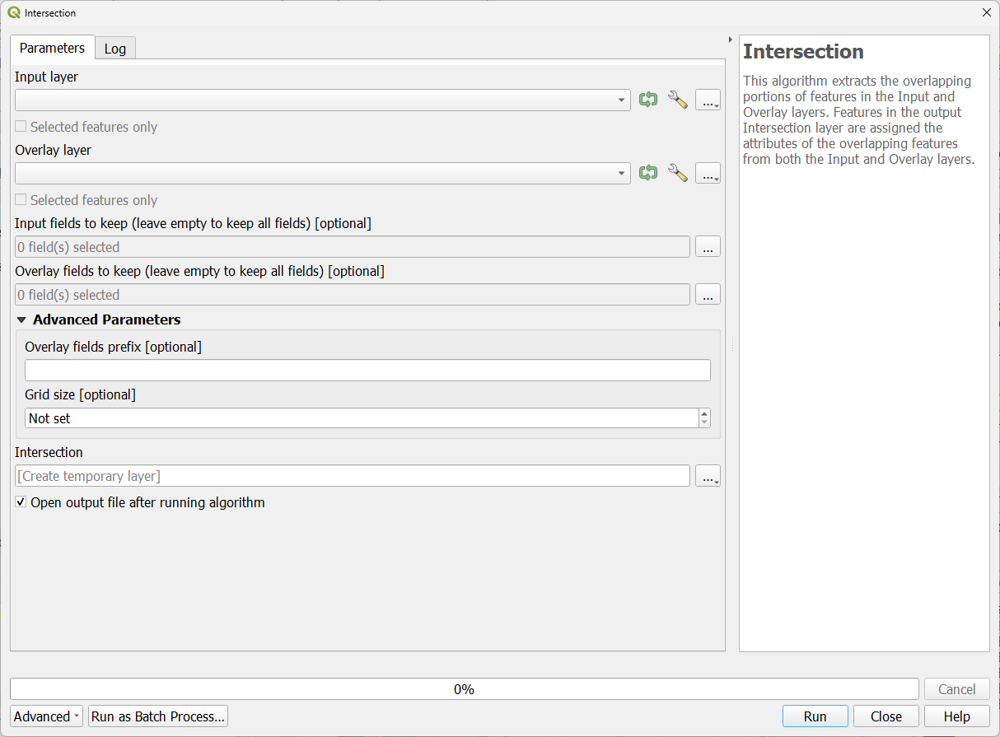

בדומה לצירוף מרחבי כל הישויות מקבלות ערכים של הישויות בשכבה הנוספת. בשונה מצירוף מרחבי - נוצרות גאומטריות חדשות. במקרה של הצלבת שני פוליגונים - פוליגונים עם גבול חדש, על פי הצלבת הגבול.

::: content-hidden
## תרגיל 8

1.  הורידו את קובץ התרגיל

2.  עשו חיץ של 100 מטרים על שכבת building (זכרו להמיר קודם את השכבה לרשת ישראל)

3.  בצעו הצלבה אל מול שכבת stops על מנת להבין אלו תחנות שייכות לאיזה מבנה.

4.  שמרו את שכבת הפלט בתוך הgpkg והגישו.

5.  למתקדמים - השתמשו בכלי **Join by lines (hub lines) על מנת לסרטט קווים בין המבנה לבין התחנות שנמצאות ב100 המטרים ממנו**
:::